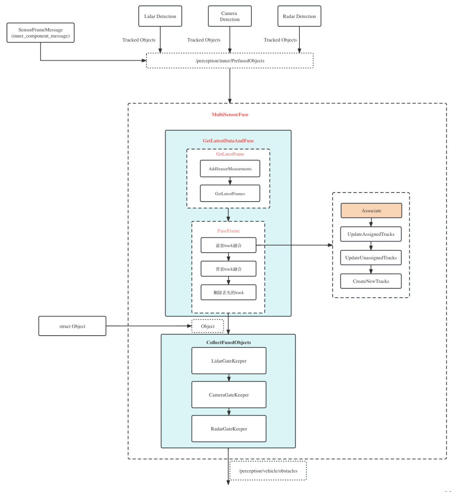

# Apollo感知融合（部分）源码解读

## 1 感知模块架构

激光雷达（lidar）、毫米波雷达（radar）、相机（camera）均有各自的检测、过滤和跟踪模块。

各传感器处理结果统一交给融合模块（multi_sensor_fusion）处理，再进行后续预测和规划。


## 2 融合子模块架构

融合的主流程：

1. **GetLatestFrames**：获取某传感器所有待融合数据，按时间排序。
2. **FuseFrame**：逐帧融合。分为前景轨迹融合、背景轨迹融合。两种轨迹融合的流程均为：
    - 数据关联
    - 关联轨迹更新
    - 未关联上的轨迹更新
    - 轨迹初始化
3. 丢失轨迹删除，结果整理等




## 3 入口

文件：modules\perception\multi_sensor_fusion\multi_sensor_fusion_component.cc

类：**MultiSensorFusionComponent**

Apollo 框架中，每个功能组件都对应一个继承自 `Component` 类的具体组件类，具体组件类中都包含 `public` 的 `Init` 方法和 `Proc` 方法，`Init` 方法实现了组件的初始化，`Proc` 方法实现了组件的具体算法流程。

对外接口：`Init`、`Proc`

对内接口：`InitAlgorithmPlugin`、`InternalProc**（*算法入口）**`


## 4 数据结构

**Object** (1个目标) → SensorObject (指定传感器) → **Track** (目标跟踪，加时间维度) → Scene (所有Track集合)

SensorObject → **Frame** (一帧目标的集合) → SensorFrame (指定传感器) → **Sensor** (传感器，管理SensorFrame)→ SensorDataManager (管理Sensor)

**Object的属性**

```cpp
id
ORB_info（theta，center，size，anchor_point，type，confidence）：ORB信息
Tracking_info（track_id，velocity，acceleration，age，latest_timestamp）：跟踪信息
CIPV（light）: 路径最近车辆
```

**Frame的属性**

```cpp
sensor_info：传感器信息
timestamp：时间戳
objects：目标集合
sensor2world_pose：位姿
```

**Track的属性**

```cpp

is_background_：是否背景
lidar_objects_, ...：sensor_id和目标的map
fused_object_：融合目标，保留最后融合进去的目标信息
is_alive_: 是否活跃
tracked_times...：跟踪计数等
```


## 5 MultiSensorFusionComponent::InternalProc

**1 融合**

```cpp
base::FramePtr frame = in_message->frame_;
frame->timestamp = in_message->timestamp_;

std::vector<base::ObjectPtr> fused_objects;
if (!fusion_->Fuse(frame, &fused_objects)) { // 融合核心函数
  AERROR << "Failed to call fusion plugin.";
  return false;
}
```

**2 高精地图校验**

**3 结果发布**


## 6 ProbabilisticFusion::Fuse

### **6.1 保存frame data**

```cpp
sensor_data_manager->AddSensorMeasurements(sensor_frame);
```

SensorDataManager::AddSensorMeasurements

```cpp
sensor_ptr->AddFrame(frame_ptr);
```

Sensor::AddFrame

```cpp
SensorFramePtr frame(new SensorFrame(frame_ptr));
```

SensorFrame::Initialize

```cpp
// 根据lidar_supplement提供的信息分成前景信息和背景信息
for (const auto& base_obj : base_objects) {
  SensorObjectPtr obj(new SensorObject(base_obj, header_));
  if (base_obj->lidar_supplement.is_background) {
    background_objects_.emplace_back(obj);
  } else {
    foreground_objects_.emplace_back(obj);
  }
}
```

### **6.2 索引相关数据帧**

不是每收到一帧数据就融合，而是攒一批数据每隔一段时间融合。

```cpp
sensor_data_manager->GetLatestFrames(fusion_time, &frames);
```

SensorDataManager::GetLatestFrame

```cpp
// 获取各传感器未融合的数据帧
// sensors_：class SensorDataManager
// std::unordered_map<std::string, SensorPtr> sensors_;
for (auto it = sensors_.begin(); it != sensors_.end(); ++it) {
    SensorFramePtr frame = it->second->QueryLatestFrame(timestamp);
    if (frame != nullptr) {
      frames->push_back(frame);
    }
  }
...
std::sort(frames->begin(), frames->end(),
          [](const SensorFramePtr& p1, const SensorFramePtr& p2) {
            return p1->GetTimestamp() < p2->GetTimestamp();
          });
```

Sensor::QueryLatestFrames

```cpp

// 上一次融合的时间戳和当前帧时间戳之间的数据帧
for (size_t i = 0; i < frames_.size(); ++i) {
  if (frames_[i]->GetTimestamp() > latest_query_timestamp_ &&
      frames_[i]->GetTimestamp() <= timestamp) {
    frames->push_back(frames_[i]);
  }
}
```

### **6.3 执行融合**

```cpp
// 融合排好序的单帧数据
for (const auto& frame : frames) {
  FuseFrame(frame);
}
```

ProbabilisticFusion::FuseFrame

```cpp
  FuseForegroundTrack(frame); // 前景数据融合
  FusebackgroundTrack(frame); // 背景数据融合
  RemoveLostTrack(); // 移除丢失轨迹
```

#### **6.3.1 背景融合**

ProbabilisticFusion::FusebackgroundTrack

##### **6.3.1.1 关联**

简单地根据track_id是否相等判断关联，等式两边分别为：

`scenes_->GetBackgroundTracks()[i]->GetFusedObject()->GetBaseObject()->track_id`

`frame_objs[i]->GetBaseObject()->track_id`

猜想：背景目标只从激光雷达中获取，因此track_id是一致的，都是激光雷达跟踪的id。

##### **6.3.1.2 更新匹配轨迹**

向轨迹中添加最近观测，并删除长期不可见轨迹。

```cpp
background_tracks[track_ind]->UpdateWithSensorObject(frame_objs[obj_ind]);
```

Track::UpdateWithSensorObject

```cpp
void Track::UpdateWithSensorObject(const SensorObjectPtr& obj) {
  // objects：与当前航迹匹配过的、和当前观测传感器类型一致的历史观测
  // typedef std::map<std::string, SensorObjectPtr> SensorId2ObjectMap;
  std::string sensor_id = obj->GetSensorId();
  SensorId2ObjectMap* objects = nullptr;
  if (IsLidar(obj)) {
    objects = &lidar_objects_;
  } else if (IsRadar(obj)) {
    objects = &radar_objects_;
  } else if (IsCamera(obj)) {
    objects = &camera_objects_;
  } else {
    return;
  }
  // 更新对应传感器类型的最新历史观测为本轮观测
  UpdateSensorObject(objects, obj);
  double time_diff = obj->GetTimestamp() - fused_object_->GetTimestamp();
  tracking_period_ += time_diff;
	
	// 删除各传感器超过最大不可见时长的全部历史观测
  UpdateSensorObjectWithMeasurement(&lidar_objects_, sensor_id,
                                    obj->GetTimestamp(),
                                    s_max_lidar_invisible_period_);
  UpdateSensorObjectWithMeasurement(&radar_objects_, sensor_id,
                                    obj->GetTimestamp(),
                                    s_max_radar_invisible_period_);
  UpdateSensorObjectWithMeasurement(&camera_objects_, sensor_id,
                                    obj->GetTimestamp(),
                                    s_max_camera_invisible_period_);

	// 更新融合对象
  if (is_background_) {
    return UpdateWithSensorObjectForBackground(obj);
  }

  fused_object_->GetBaseObject()->latest_tracked_time = obj->GetTimestamp();
  UpdateSupplementState(obj);
  UpdateUnfusedState(obj);
  is_alive_ = true;
}
```

Track::UpdateSensorObject

```cpp
void Track::UpdateSensorObject(SensorId2ObjectMap* objects,
                               const SensorObjectPtr& obj) {
  std::string sensor_id = obj->GetSensorId();
  auto it = objects->find(sensor_id);
  if (it == objects->end()) {
    (*objects)[sensor_id] = obj; // 没关联过的传感器首次赋值
  } else {
    it->second = obj; // 关联过的传感器，修改value值
  }
}
```

Track::UpdateSensorObjectWithMeasurement

```cpp
void Track::UpdateSensorObjectWithMeasurement(SensorId2ObjectMap* objects,
                                              const std::string& sensor_id,
                                              double measurement_timestamp,
                                              double max_invisible_period) {
  for (auto it = objects->begin(); it != objects->end();) {
    if (it->first != sensor_id) {
      double period = measurement_timestamp - it->second->GetTimestamp();
      if (period > max_invisible_period) {
        it->second = nullptr;
        it = objects->erase(it);
      } else {
        ++it;
      }
    } else {
      ++it;
    }
  }
}
```

Track::UpdateWithSensorObjectForBackground

```cpp
void Track::UpdateWithSensorObjectForBackground(const SensorObjectPtr& obj) {
  std::shared_ptr<base::Object> fused_base_object =
      fused_object_->GetBaseObject();
  std::shared_ptr<const base::Object> measurement_base_object =
      obj->GetBaseObject();
  int track_id = fused_base_object->track_id;
  *fused_base_object = *measurement_base_object; // 修改fused_base_object为最新观测对象
  fused_base_object->track_id = track_id; // 保持fused_base_object的track_id不变
}
```

##### **6.3.1.3 更新未匹配轨迹**

和更新匹配轨迹的区别在于，没有追加新的观测对象。

```cpp
background_tracks[i]->UpdateWithoutSensorObject(sensor_id, frame->GetTimestamp());
```

Track::UpdateWithoutSensorObject

```cpp
// 删除各传感器超过最大不可见时长的全部历史观测（Radar、Camera同理）
UpdateSensorObjectWithoutMeasurement(&lidar_objects_, sensor_id,
                                     measurement_timestamp,
                                     s_max_lidar_invisible_period_);
...
// 三个传感器之一不为空即可继续跟踪
is_alive_ = (!lidar_objects_.empty()) || (!radar_objects_.empty()) ||
            (!camera_objects_.empty());
```

Track::UpdateSensorObjectWithoutMeasurement

```cpp
void Track::UpdateSensorObjectWithoutMeasurement(SensorId2ObjectMap* objects,
                                                 const std::string& sensor_id,
                                                 double measurement_timestamp,
                                                 double max_invisible_period) {
  for (auto it = objects->begin(); it != objects->end();) {
    double period = measurement_timestamp - it->second->GetTimestamp();
    if (it->first == sensor_id) {
      it->second->SetInvisiblePeriod(period);
    } else if (it->second->GetInvisiblePeriod() > 0.0) {
      it->second->SetInvisiblePeriod(period);
    }

    if (period > max_invisible_period) {
      it->second = nullptr;
      it = objects->erase(it);
    } else {
      ++it;
    }
  }
}
```

##### **6.3.1.4 未匹配观测创建新轨迹**

```cpp
for (size_t i = 0; i < object_tag.size(); ++i) {
    if (!object_tag[i]) {
      TrackPtr track = TrackPool::Instance().Get();
      track->Initialize(frame_objs[i], true);
      scenes_->AddBackgroundTrack(track);
    }
  }
```

Track::Initialize

```cpp
bool Track::Initialize(SensorObjectPtr obj, bool is_background) {
  Reset();
  int track_id = static_cast<int>(GenerateNewTrackId()); // 新的track_id
  is_background_ = is_background;
  std::shared_ptr<base::Object> fused_base_obj = fused_object_->GetBaseObject();
  std::shared_ptr<const base::Object> sensor_base_obj = obj->GetBaseObject();
  *fused_base_obj = *sensor_base_obj; // 融合obj = 观测obj
  fused_base_obj->track_id = track_id;
  UpdateWithSensorObject(obj); // 更新各种时间、历史观测map等
  return true;
}
```

#### **6.3.2 前景融合**

ProbabilisticFusion::FuseForegroundTrack

##### **6.3.2.1 关联**

```cpp
AssociationOptions options;
AssociationResult association_result;
matcher_->Associate(options, frame, scenes_, &association_result);
```

HMTrackersObjectsAssociation::Associate

（HM：Hungarian Matcher，匈牙利匹配）

###### **6.3.2.1.1 轨迹或观测为空，直接退出**

###### **6.3.2.1.2 IdAssign**

根据track_id关联，等式两边分别为：

`fusion_tracks[i]->GetSensorObject(sensor_id)->GetBaseObject()->track_id`

`sensor_objects[i]->GetBaseObject()->track_id`

猜想：每个传感器单独的tracking模块维持同一目标track_id一致，根据此原理可简单关联

###### **6.3.2.1.3 计算距离矩阵**

```cpp
ComputeAssociationDistanceMat(fusion_tracks, sensor_objects, ref_point,
                                association_result->unassigned_tracks,
                                association_result->unassigned_measurements,
                                &association_mat);
```

HMTrackersObjectsAssociation::ComputeAssociationDistanceMat

```cpp
// i: 轨迹索引
for (size_t i = 0; i < unassigned_tracks.size(); ++i) {
  size_t fusion_idx = unassigned_tracks[i];
  (*association_mat)[i].resize(unassigned_measurements.size());
  const TrackPtr& fusion_track = fusion_tracks[fusion_idx];
  // j：观测索引
  for (size_t j = 0; j < unassigned_measurements.size(); ++j) {
    size_t sensor_idx = unassigned_measurements[j];
    const SensorObjectPtr& sensor_object = sensor_objects[sensor_idx];
    double distance = s_match_distance_thresh_;
    // 观测中心与轨迹中心的欧式距离
    double center_dist =
        (sensor_object->GetBaseObject()->center -
         fusion_track->GetFusedObject()->GetBaseObject()->center).norm();
    // 距离小于30米，进行精细化计算
    if (center_dist < s_association_center_dist_threshold_) {
      distance =
          track_object_distance_.Compute(fusion_track, sensor_object, opt);
    } else {
      ADEBUG << "center_distance " << center_dist
             << " exceeds slack threshold "
             << s_association_center_dist_threshold_
             << ", track_id: " << fusion_track->GetTrackId()
             << ", obs_id: " << sensor_object->GetBaseObject()->track_id;
    }
    (*association_mat)[i][j] = distance;
    ADEBUG << "track_id: " << fusion_track->GetTrackId()
           << ", obs_id: " << sensor_object->GetBaseObject()->track_id
           << ", distance: " << distance;
  }
}
```

TrackObjectDistance::Compute

```cpp
// 拿出轨迹中每个传感器的最新Object
SensorObjectConstPtr lidar_object = fused_track->GetLatestLidarObject();
SensorObjectConstPtr radar_object = fused_track->GetLatestRadarObject();
SensorObjectConstPtr camera_object = fused_track->GetLatestCameraObject();

// 当观测传感器=激光，距离=min{与上一激光距离，与上一相机距离，与上一毫米波距离}
if (IsLidar(sensor_object)) {
  if (lidar_object != nullptr) {
    distance = ComputeLidarLidar(lidar_object, sensor_object, *ref_point);
    min_distance = std::min(distance, min_distance);
  }
  if (radar_object != nullptr) {
    distance = ComputeLidarRadar(radar_object, sensor_object, *ref_point);
    min_distance = std::min(distance, min_distance);
  }
  if (camera_object != nullptr) {
    bool is_lidar_track_id_consistent =
        IsTrackIdConsistent(lidar_object, sensor_object);
    distance = ComputeLidarCamera(sensor_object, camera_object, true,
                                  is_lidar_track_id_consistent);
    min_distance = std::min(distance, min_distance);
  }
// 当观测传感器=毫米波，同理
} else if (IsRadar(sensor_object)) {
  if (lidar_object != nullptr) {
    distance = ComputeLidarRadar(lidar_object, sensor_object, *ref_point);
    min_distance = std::min(distance, min_distance);
  }
  if (radar_object != nullptr) {
    distance = ComputeRadarRadar(radar_object, sensor_object, *ref_point);
    min_distance = std::min(distance, min_distance);
  }
  if (camera_object != nullptr) {
    distance = ComputeRadarCamera(sensor_object, camera_object);
    min_distance = std::min(distance, min_distance);
  }
// 当观测传感器=相机，只计算和上一激光距离
} else if (IsCamera(sensor_object)) {
  if (lidar_object != nullptr) {
    bool is_camera_track_id_consistent =
        IsTrackIdConsistent(camera_object, sensor_object);
    distance = ComputeLidarCamera(lidar_object, sensor_object, false,
                                  is_camera_track_id_consistent);
    min_distance = std::min(distance, min_distance);
  }
} else {
  AERROR << "fused sensor type is not support";
}
```

**(1) TrackObjectDistance::ComputeLidarLidar**

```cpp
// 粗糙计算中心距离
double center_distance = (sensor_object->GetBaseObject()->center -
                          fused_object->GetBaseObject()->center)
                             .head(2)
                             .norm();
// 超过10米返回一个极大值
if (center_distance > s_lidar2lidar_association_center_dist_threshold_) {
  ADEBUG << "center distance exceed lidar2lidar tight threshold: "
         << "center_dist@" << center_distance << ", "
         << "tight_threh@"
         << s_lidar2lidar_association_center_dist_threshold_;
  return (std::numeric_limits<float>::max)();
}
// 小于10米，精细计算
float distance =
    ComputePolygonDistance3d(fused_object, sensor_object, ref_pos, range);
```

TrackObjectDistance::ComputePolygonDistance3d

```cpp
// 获取点云的质心
const base::ObjectConstPtr& obj_f = fused_object->GetBaseObject();
Eigen::Vector3d fused_poly_center(0, 0, 0);
if (!QueryPolygonDCenter(obj_f, ref_pos, range, &fused_poly_center)) {
  return (std::numeric_limits<float>::max());
}
const base::ObjectConstPtr obj_s = sensor_object->GetBaseObject();
Eigen::Vector3d sensor_poly_center(0, 0, 0);
if (!QueryPolygonDCenter(obj_s, ref_pos, range, &sensor_poly_center)) {
  return (std::numeric_limits<float>::max());
}
// 时间戳对齐（即轨迹预测，time_diff = 时间戳之差）
double fusion_timestamp = fused_object->GetTimestamp();
double sensor_timestamp = sensor_object->GetTimestamp();
double time_diff = sensor_timestamp - fusion_timestamp;
fused_poly_center(0) += obj_f->velocity(0) * time_diff;
fused_poly_center(1) += obj_f->velocity(1) * time_diff;
float distance =
    ComputeEuclideanDistance(fused_poly_center, sensor_poly_center);
return distance;
```

**(2)  TrackObjectDistance::ComputeLidarCamera**

```cpp
// id一致时，判断距离是否超过动态阈值
if (!is_track_id_consistent) {
  if (LidarCameraCenterDistanceExceedDynamicThreshold(lidar, camera)) {
    return distance_thresh_;
  }
}
float distance = distance_thresh_;
// 都投影到相机坐标下
base::BaseCameraModelPtr camera_model = QueryCameraModel(camera);
if (camera_model == nullptr) {
  AERROR << "Failed to get camera model for " << camera->GetSensorId();
  return distance;
}
Eigen::Matrix4d world2camera_pose;
if (!QueryWorld2CameraPose(camera, &world2camera_pose)) {
  AERROR << "Failed to query camera pose";
  return distance;
}
Eigen::Matrix4d lidar2world_pose;
if (!QueryLidar2WorldPose(lidar, &lidar2world_pose)) {
  AERROR << "Failed to query lidar pose";
  return distance;
}
Eigen::Matrix4d lidar2camera_pose =
    static_cast<Eigen::Matrix<double, 4, 4, 0, 4, 4>>(world2camera_pose *
                                                      lidar2world_pose);
// 距离计算
const base::PointFCloud& cloud =
    lidar->GetBaseObject()->lidar_supplement.cloud;
const base::BBox2DF& camera_bbox =
    camera->GetBaseObject()->camera_supplement.box;
const base::Point2DF camera_bbox_ct = camera_bbox.Center();
const Eigen::Vector2d box2d_ct =
    Eigen::Vector2d(camera_bbox_ct.x, camera_bbox_ct.y);
ADEBUG << "object cloud size : " << cloud.size();
// 点云数据存在时
if (cloud.size() > 0) {
  // 2.1 if cloud is not empty, calculate distance according to pts box
  // similarity
  ProjectionCacheObject* cache_object = QueryProjectionCacheObject(
      lidar, camera, camera_model, measurement_is_lidar);
  if (cache_object == nullptr) {
    AERROR << "Failed to query projection cached object";
    return distance;
  }
  // 相似度 = 距离相似度 + 形状相似度
  double similarity =
      ComputePtsBoxSimilarity(&projection_cache_, cache_object, camera_bbox);
  // 相似度 -> 距离
  distance =
      distance_thresh_ * ((1.0f - static_cast<float>(similarity)) /
                          (1.0f - vc_similarity2distance_penalize_thresh_));
} else {
// 点云数据不存在时，求中心点距离
  Eigen::Vector3d projected_velo_ct;
  QueryProjectedVeloCtOnCamera(lidar, camera, lidar2camera_pose,
                               &projected_velo_ct);
  if (projected_velo_ct[2] > 0) {
    Eigen::Vector2f project_pt2f = camera_model->Project(
        Eigen::Vector3f(static_cast<float>(projected_velo_ct[0]),
                        static_cast<float>(projected_velo_ct[1]),
                        static_cast<float>(projected_velo_ct[2])));
    Eigen::Vector2d project_pt2d = project_pt2f.cast<double>();
    Eigen::Vector2d ct_diff = project_pt2d - box2d_ct;
    distance =
        static_cast<float>(ct_diff.norm()) * vc_diff2distance_scale_factor_;
  } else {
    distance = std::numeric_limits<float>::max();
  }
}
ADEBUG << "ComputeLidarCamera distance: " << distance;
return distance;
```

ComputePtsBoxSimilarity

```cpp
// 距离相似度：点云的每个点到BBox的距离，用了假设检验那一套，Chi2等统计技术
double location_similarity =
    ComputePtsBoxLocationSimilarity(cache, object, camera_bbox);
// 形状相似度：也用了统计的思想
double shape_similarity =
    ComputePtsBoxShapeSimilarity(cache, object, camera_bbox);
// 相似度融合（0-1）
double fused_similarity =
    FuseTwoProbabilities(location_similarity, shape_similarity);
```

ComputePtsBoxLocationSimilarity

```cpp
double ComputePtsBoxLocationSimilarity(const ProjectionCachePtr& cache,
                                       const ProjectionCacheObject* object,
                                       const base::BBox2DF& camera_bbox) {
  static const double min_p = 1e-6;
  static const double max_p = 1 - 1e-6;
  double x_std_dev = 0.4;
  double y_std_dev = 0.5;
  size_t check_augmented_iou_minimum_pts_num = 20;
  float augmented_buffer = 25.0f;
  if (object->Empty()) {
    ADEBUG << "cache object is empty!";
    return min_p;
  }
  Eigen::Vector2d mean_pixel_dist(0.0, 0.0);
  // calculate mean x y pixel distance
  const size_t start_ind = object->GetStartInd();
  const size_t end_ind = object->GetEndInd();
  if (end_ind - start_ind >= check_augmented_iou_minimum_pts_num) {
    base::BBox2DF velo_bbox = object->GetBox();
    float augmented_iou =
        CalculateAugmentedIOUBBox(velo_bbox, camera_bbox, augmented_buffer);
    if (augmented_iou < kFloatEpsilon) {
      ADEBUG << "augmented iou is empty!";
      return min_p;
    }
  }
  for (size_t i = start_ind; i < end_ind; ++i) {
	  // 点云的2d像素坐标
    auto* velo_pt2d = cache->GetPoint2d(i);
    if (velo_pt2d == nullptr) {
      AERROR << "query pt from projection cache failed!";
      continue;
    }
    if (velo_pt2d->x() >= camera_bbox.xmin &&
        velo_pt2d->x() < camera_bbox.xmax &&
        velo_pt2d->y() >= camera_bbox.ymin &&
        velo_pt2d->y() < camera_bbox.ymax) {
      continue;
    }
    Eigen::Vector2d diff;
    // 与相机bbox计算偏移量
    diff.x() = std::max(0.0, camera_bbox.xmin - velo_pt2d->x());
    diff.x() = std::max(diff.x(), velo_pt2d->x() - camera_bbox.xmax);
    diff.y() = std::max(0.0, camera_bbox.ymin - velo_pt2d->y());
    diff.y() = std::max(diff.y(), velo_pt2d->y() - camera_bbox.ymax);
    mean_pixel_dist += diff;
  }
  // 归一化
  mean_pixel_dist /= static_cast<double>(object->Size());
  ADEBUG << "mean_pixel_dist is: " << mean_pixel_dist;
  // normalize according to box size
  Eigen::Vector2d box_size = Eigen::Vector2d(
      camera_bbox.xmax - camera_bbox.xmin, camera_bbox.ymax - camera_bbox.ymin);
  mean_pixel_dist.array() /= box_size.array();
  // assuming the normalized distance obeys gauss distribution
  // 假设偏移距离服从高斯分布，计算chi2统计量
  double square_norm_mean_pixel_dist =
      mean_pixel_dist.x() * mean_pixel_dist.x() / x_std_dev / x_std_dev +
      mean_pixel_dist.y() * mean_pixel_dist.y() / y_std_dev / y_std_dev;
  // use chi-square distribution. Cauchy may be more reasonable.
  double location_similarity =
      1 - ChiSquaredCdf2TableFun(square_norm_mean_pixel_dist);
  // for numerical stability
  location_similarity = std::max(min_p, std::min(max_p, location_similarity));
  return location_similarity;
}
```

ChiSquaredCdf2TableFun

```cpp
inline double ChiSquaredCdf2TableFun(double dist) {
  static constexpr double step = 0.050000;
  static const size_t table_size =
      sizeof(ChiSquaredCdf2TableTable) / sizeof(double);
  double dist_ind = dist / step;
  int dist_int = static_cast<int>(dist_ind);
  double w = dist_ind - dist_int;
  if (dist_ind >= table_size - 1) {
    return 1.0;
  }
  return (ChiSquaredCdf2TableTable[dist_int] * (1 - w) +
          ChiSquaredCdf2TableTable[dist_int + 1] * w);
}
```

###### **6.3.2.1.4 匹配**

```cpp
bool state = MinimizeAssignment(
    association_mat, track_ind_l2g, measurement_ind_l2g,
    &association_result->assignments, &association_result->unassigned_tracks,
    &association_result->unassigned_measurements);
```

HMTrackersObjectsAssociation::MinimizeAssignment

```cpp
// GatedHungarianMatcher<T>::Match
optimizer_.Match(static_cast<float>(s_match_distance_thresh_),
                 static_cast<float>(s_match_distance_bound_), opt_flag,
                 &local_assignments, &local_unassigned_tracks,
                 &local_unassigned_measurements);
```

##### **6.3.2.2 更新匹配航迹**

```cpp
UpdateAssignedTracks(frame, assignments);
```

ProbabilisticFusion::UpdateAssignedTracks

```cpp
for (size_t i = 0; i < assignments.size(); ++i) {
  size_t track_ind = assignments[i].first;
  size_t obj_ind = assignments[i].second;
  // trackers_: std::vector<std::shared_ptr<BaseTracker>> trackers_;  // for foreground
  trackers_[track_ind]->UpdateWithMeasurement(options, f_ground_objs[obj_ind],
                                              frame->GetTimestamp());
}
```

PbfTracker::UpdateWithMeasurement

```dart
void PbfTracker::UpdateWithMeasurement(const TrackerOptions& options,
                                       const SensorObjectPtr measurement,
                                       double target_timestamp) {
  std::string sensor_id = measurement->GetSensorId();
  ADEBUG << "fusion_updating..." << track_->GetTrackId() << " with "
         << sensor_id << "..." << measurement->GetBaseObject()->track_id << "@"
         << FORMAT_TIMESTAMP(measurement->GetTimestamp());
  // 存在、运动、形状和类别都有Fusion
  // std::unique_ptr<BaseTypeFusion> type_fusion_ = nullptr;
  // std::unique_ptr<BaseMotionFusion> motion_fusion_ = nullptr;
  // std::unique_ptr<BaseExistenceFusion> existence_fusion_ = nullptr;
  // std::unique_ptr<BaseShapeFusion> shape_fusion_ = nullptr;
  existence_fusion_->UpdateWithMeasurement(measurement, target_timestamp,
                                           options.match_distance);
  motion_fusion_->UpdateWithMeasurement(measurement, target_timestamp);
  shape_fusion_->UpdateWithMeasurement(measurement, target_timestamp);
  type_fusion_->UpdateWithMeasurement(measurement, target_timestamp);
  // 下面这行在背景融合里面出现过
  track_->UpdateWithSensorObject(measurement);
}
```

KalmanMotionFusion::UpdateWithMeasurement（其他Fusion暂时略过）

```dart
MotionFusionWithMeasurement(measurement, time_diff);
```

KalmanMotionFusion::MotionFusionWithMeasurement

```dart
// we use kalman filter to update our tracker.
// The pipeline is detailed as follows:
// 1) compute the time diff to predict the tracker
//    (although we introduce the acceleration, we
//    doesn't use it to update the position)
// 2) DeCorrelation the uncertainty matrix (we belief
//    that the velocity won`t be affected by position)
// 3) compute the acceleration of the measurement
// 4) use the history radar or lidar(depend on which sensor
//    type in current) to correct the observation
// 5) set r_matrix according to converged or not
// 6) use kalman to correct the predict before
// 7) use correction breakdown to eliminate the unreasonable
//    acceleration gain or velocity noise

// 1. 预测
Eigen::MatrixXd transform_matrix;
Eigen::MatrixXd env_uncertainty;

transform_matrix.setIdentity(6, 6);
transform_matrix(0, 2) = time_diff;
transform_matrix(1, 3) = time_diff;
transform_matrix(2, 4) = time_diff;
transform_matrix(3, 5) = time_diff;

env_uncertainty.setIdentity(6, 6);
env_uncertainty *= 0.5;

kalman_filter_.Predict(transform_matrix, env_uncertainty);

// Predict的实现：
// transform_matrix_ = transform_matrix;
// env_uncertainty_ = env_uncertainty_matrix;
// global_states_ = transform_matrix_ * global_states_;
// global_uncertainty_ =
//     transform_matrix_ * global_uncertainty_ * transform_matrix_.transpose() +
//     env_uncertainty_;

// 2. 更新
// 则部分有点乱，分别区分了Lidar，Radar，Camera
```

##### **6.3.2.3 更新未匹配航迹**

与更新匹配航迹的区别在于，只预测不更新

KalmanMotionFusion::MotionFusionWithoutMeasuremen

```dart
void KalmanMotionFusion::MotionFusionWithoutMeasurement(
    const double time_diff) {
  Eigen::MatrixXd transform_matrix;
  Eigen::MatrixXd env_uncertainty;
  transform_matrix.setIdentity(6, 6);
  transform_matrix(0, 2) = time_diff;
  transform_matrix(1, 3) = time_diff;
  env_uncertainty.setZero(6, 6);
  kalman_filter_.Predict(transform_matrix, env_uncertainty);
}

```

##### **6.3.2.4 未匹配观测创建新轨迹**

和背景融合该步流程类似。

#### **6.3.3 移除失效航迹**

```cpp
RemoveLostTrack();
```

ProbabilisticFusion::RemoveLostTrack()

```dart
for (size_t i = 0; i < foreground_tracks.size(); ++i) {
    if (foreground_tracks[i]->IsAlive()) { // 融合过程中就标记了是否失效
      foreground_tracks[f_alive_index] = foreground_tracks[i];
      trackers_[f_alive_index] = trackers_[i];
      ++f_alive_index;
    }
  }
  
// 在Track::UpdateWithoutSensorObject中：
// is_alive_ = (!lidar_objects_.empty()) || (!radar_objects_.empty()) ||
// (!camera_objects_.empty());
```

#### **6.3.4 整理结果**

```cpp
CollectFusedObjects(fusion_time, fused_objects);
```


## Ref

- [知乎：卡尔曼滤波器是如何运用于多传感器融合的？](https://www.zhihu.com/question/46869663/answer/2263283851)
- [Apollo官方文档：Apollo感知模块综述](https://apollo.baidu.com/docs/apollo/9.0/md_docs_2_xE5_xBA_x94_xE7_x94_xA8_xE5_xAE_x9E_xE8_xB7_xB5_2_xE5_xBC_x80_xE5_x8F_x91_xE8_xB0_x83_a60005757a7675d3a07ad7f96960ee2c.html)
- [个人博客：Apollo感知模块](https://blog.shipengx.com/archives/46155f38.html)
- [腾讯云：自动驾驶 Apollo 源码分析系列，感知篇(八)：感知融合代码的基本流程](https://cloud.tencent.com/developer/article/1911327)
- [腾讯云：自动驾驶 Apollo 源码分析系列，感知篇(九)：感知融合中的数据关联细节](https://cloud.tencent.com/developer/article/1911330)
- [知乎：2.1 Apollo感知篇-Fusion源码解析（一）- 基础数据结构和类](https://zhuanlan.zhihu.com/p/424224471)