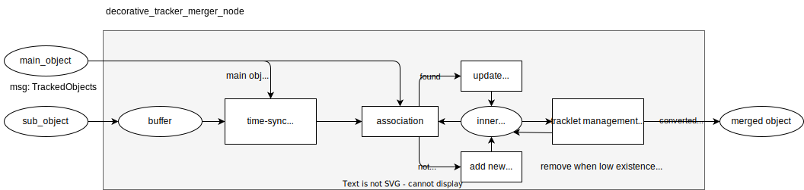
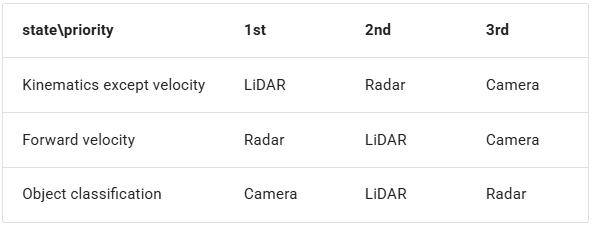

# Autoware感知融合

# **一、目标融合（静态）**

代码位置：*autoware.universe/perception/autoware_object_merger*

## 主流程

代码位置：*ObjectAssociationMergerNode::objectsCallback*

```
+-----------------------------+
| objectsCallback 回调函数     |
| (输入: input_objects0_msg,   |
|       input_objects1_msg)    |
+-----------------------------+
             |
             v
+-----------------------------+
|      数据检查、坐标转换、    |
|      初始化输出消息头信息    |
+-----------------------------+
             |
             v
+-----------------------------+
| 计算对象关联得分矩阵          |
| (data_association_->         |
| calcScoreMatrix(...))        |
+-----------------------------+
             |
             v
+-----------------------------+
| 使用 GNN 算法进行对象匹配     |
| (data_association_->assign)  |
| 生成 direct_assignment 和    |
| reverse_assignment           |
+-----------------------------+
             |
             v
+-----------------------------+
| 合并 objects0:               |
| 遍历每个 object0:            |
|   if 匹配到 object1:         |
|     根据 priority_mode_ 选择  |
|     object0 或 object1       |
|   else:                      |
|     直接添加 object0 到输出   |
+-----------------------------+
             |
             v
+-----------------------------+
| 合并 objects1:               |
| 遍历每个 object1:            |
|   if 未匹配到 object0:        |
|     直接添加 object1 到输出   |
+-----------------------------+
             |
             v
+-----------------------------+
| 移除重叠的未知对象（可选）    |
|  分离已知和未知对象           |
|  移除与已知对象重叠的未知对象  |
+-----------------------------+
             |
             v
+-----------------------------+
| 发布融合后的对象消息          |
+-----------------------------+
```

## 计算关联得分矩阵

代码位置：*data_association.cpp | Eigen::MatrixXd DataAssociation::calcScoreMatrix*

```
+-------------------+
| 开始计算得分      |
+-------------------+
          |
          v
+-------------------+
| 获取 object1 和 object0 |
+-------------------+
          |
          v
+-------------------+
| 获取 object1_label 和 object0_label |
+-------------------+
          |
          v
+-------------------+
| 检查 can_assign_matrix_ |
| 是否可以关联？         |
+-------------------+
          |
          v
      +---+---+
      |       |
      No      Yes
      |       |
      v       v
+-------+  +-------------------+
| score=0 |  | 计算距离 (dist)  |
+-------+  +-------------------+
                  |
                  v
+-------------------+
| 检查距离门限       |
| dist <= max_dist?  |
+-------------------+
                  |
                  v
      +---+-------+
      |           |
      No          Yes
      |           |
      v           v
+-------+  +-------------------+
| score=0 |  | 计算角度差 (angle) |
+-------+  +-------------------+
                  |
                  v
+-------------------+
| 检查角度门限       |
| |angle| <= max_rad?|
+-------------------+
                  |
                  v
      +---+-------+
      |           |
      No          Yes
      |           |
      v           v
+-------+  +-------------------+
| score=0 |  | 计算 IoU (iou)   |
+-------+  +-------------------+
                  |
                  v
+-------------------+
| 检查 IoU 门限      |
| iou >= min_iou?   |
+-------------------+
                  |
                  v
      +---+-------+
      |           |
      No          Yes
      |           |
      v           v
+-------+  +-------------------+
| score=0 |  | 计算得分 (score) |
|         |  | score = (max_dist - min(dist, max_dist)) / max_dist |
+-------+  +-------------------+
                  |
                  v
+-------------------+
| 检查得分门限       |
| score >= score_threshold_? |
+-------------------+
                  |
                  v
      +---+-------+
      |           |
      No          Yes
      |           |
      v           v
+-------+  +-------------------+
| score=0 |  | 存储得分到 score_matrix |
+-------+  +-------------------+
                  |
                  v
+-------------------+
| 返回 score_matrix  |
+-------------------+
```

## 对象匹配

代码位置：*data_association.cpp | void DataAssociation::assign → successive_shortest_path.cpp → ssp.hpp | class SSP : public GnnSolverInterface*

SSP（Successive Shortest Path）算法是一个贪心的算法。它的思路是每次寻找单位费用最小的增广路进行增广，直到图上不存在增广路为止。

如果图上存在单位费用为负的圈，SSP 算法无法正确求出该网络的最小费用最大流。此时需要先使用消圈算法消去图上的负圈。

## 移除重叠的未知对象

代码位置：*bool isUnknownObjectOverlapped*

unknown表明检测器未识别出对象类别。如果和一个known类别的对象重叠，则需要删除。

首先判断欧式距离，超出阈值返回false不交叠。其次计算percision、recall、giou三个指标，任意一个指标超过设定的阈值，说明交叠，从结果列表中删除unknown object。

# **二、跟踪目标融合（动态）**

代码位置：*autoware.universe-main/perception/autoware_tracking_object_merger*

在 decorative_tracker_merger 中，我们假设对象分为两类：主导跟踪对象和子跟踪对象。名称 `decorative` 表示子跟踪对象用于补充主要对象。通常，主要跟踪对象来自 LiDAR，子跟踪对象来自 Radar 或 Camera。

## **主流程**



## **时间同步**

子对象（雷达或相机）通常比主导对象（LiDAR）具有更高的频率。所以我们需要将 sub 对象的时间同步到 dominant 对象。

## **数据管理**

在数据关联中，我们使用以下规则来确定两个跟踪对象是否为同一对象。

gate 门控：

- distance gate：对象间距离
- angle gate：对象间角度
- mahalanobis_distance_gate： 马氏距离
- min_iou_gate：最小iou
- max_velocity_gate：最大速度

score 得分：用对象间距离表示得分

## **轨迹更新**

不同信息融合的优先级：

速度以外运动学：Lidar > Radar > Camera

前进速度：Radar > Lidar > Camera

类别：Camera > Lidar > Radar



## **轨迹管理**

`existence_probability` 管理轨迹，每种传感器有不同的初始化值。

当轨迹被某一个传感器更新时，修改为该传感器的初始值。

当轨迹没有被更新时，概率乘以一个衰减概率。

如果概率>publish_probability_threshold，且上次更新时间<max_dt，则对象发布。

如果概率<publish_probability_threshold，且上次更新时间<max_dt，则对象删除。

# Ref

- https://autowarefoundation.github.io/autoware.universe/latest/perception/autoware_object_merger/
- https://autowarefoundation.github.io/autoware.universe/main/perception/autoware_tracking_object_merger/#data-association