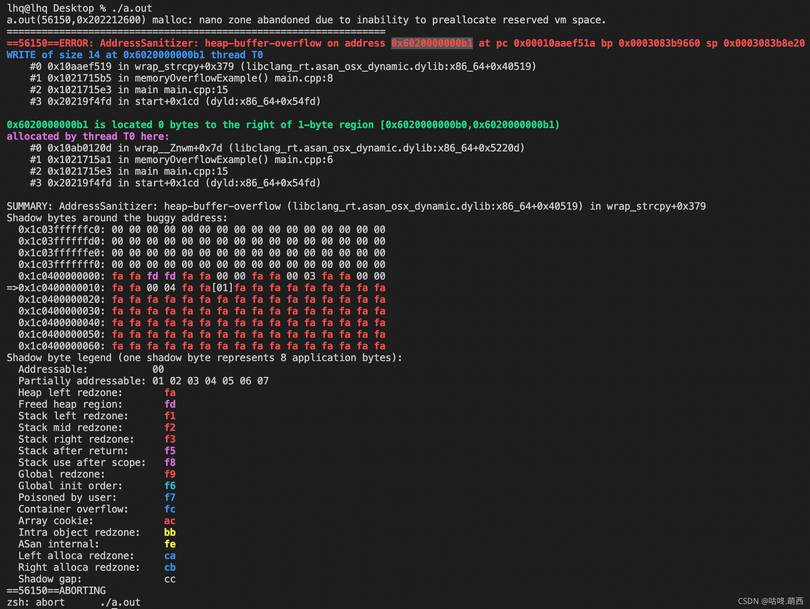
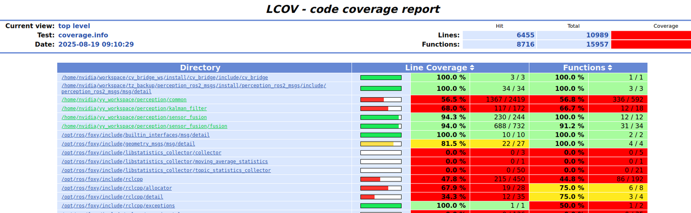

# C++工程项目好用的内存检查、覆盖率统计、日志工具

## 一、AddressSanitizer内存检查工具

当程序意外崩溃，出现段错误等内存性错误时，通常无法定位问题代码，难以排查。

AddressSanitizer可以帮助定位崩溃代码。它在运行前检测。原理是在编译时将额外的代码插入到目标程序中，对内存的读写操作进行检测和记录。生产环境中不应使用。

使用方式是，编译时添加选项：

```
g++ -fsanitize=address -g main.cpp
```

或在CMake中集成：

```
set(CMAKE_CXX_FLAGS "${CMAKE_CXX_FLAGS} -fsanitize=address -g")
```

在程序运行时即可输出报错堆栈和代码行数。只要CMake中add_executable的.cpp，都可以参与检测。

能够检测的错误类型：

- 堆溢出：堆内存访问越界，如：动态new出来的对象
- 内存泄漏：动态分配的堆内存，由于某种原因未释放，如new后没delete
- 栈溢出：栈内存访问越界，如：局部变量
- 数据段溢出：访问数组或指针越界
- 已释放内存继续使用



## 二、Lcov统计代码执行覆盖率

有时自己以为写的逻辑在运行时都命中了，其实不然。Lcov可以帮助统计运行时函数与代码行的命中次数。帮助上线前充分测试。

安装：

```
sudo apt install lcov
```

CMake集成：

```
add_compile_options(--coverage -O0 -g)
add_link_options(--coverage)
```

在程序运行前，清理旧数据（可选）：

```
lcov --directory . --zerocounters
```

其中，”.”文件夹指的是.gcno和.gcda文件所在的文件夹：

```
my_project/
├── CMakeLists.txt
├── src/
│   └── main.cpp
├── build/
│   ├── CMakeFiles/
│   │   └── my_target.dir/ 【进到这个文件夹下，这个文件夹为.】
│   │       ├── main.cpp.o
│   │       ├── main.cpp.gcno【编译时生成】
│   │       └── main.cpp.gcda 【运行结束后生成】
│   ├── my_target (可执行程序)
│   └── coverage.info
```

执行程序到程序运行结束退出（或程序执行到__gcov_flush()），才会生成gcda文件。

统计gcda文件与并生成统计html：

```
# 收集数据
lcov --directory . --capture --output-file coverage.info

# 生成 HTML 页面，入口位置 coverage_report/index.html
genhtml coverage.info --output-directory coverage_report
```




## 三、LogRotate日志轮转

安装

```
sudo apt install logrotate
```

也可以离线安装，下载具体版本https://mirrors.aliyun.com/blfs/conglomeration/logrotate/ ，按照https://www.linuxfromscratch.org/blfs/view/10.0/general/logrotate.html的指引安装，如果安装过程报错，可能某些文件没有chmod +x 或者没有sudo。

```
vim /etc/logrotate.d/myprogram
```

在配置文件中输入：

```
/home/nvidia/yy_workspace/perception/log/*.txt {
        daily         # 多久轮转一次，weekly，monthly
	size 2M       # 超过2M触发轮转
	rotate 2      # 最多几个文件轮转
	nocompress    # 是否压缩，compress压缩为.gz
	missingok     # 日志不存在不报错
	notifempty    # 空日志不轮转
	copytruncate  # 复制截断原日志文件，适用于正在运行的文件，注意用>>而非>，否则由于文件描述符等原因，原文件大小不减
}
```

轮转的触发条件：手动触发，配置定时任务（cron）

1、手动触发

```
logrotate -f -s /tmp/logrotate.status /etc/logrotate.d/percpostproc # -f 强制 # -d 演练 # -s status写入的文件
```

2、配置定时任务

```
crontab -e
```

在文件中输入：（每5分钟执行一次）

```
*/5 * * * * /usr/sbin/logrotate -s /tmp/logrotate.status /etc/logrotate.d/percpostproc
```