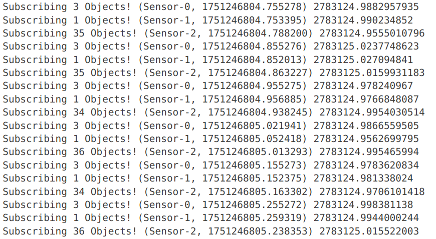
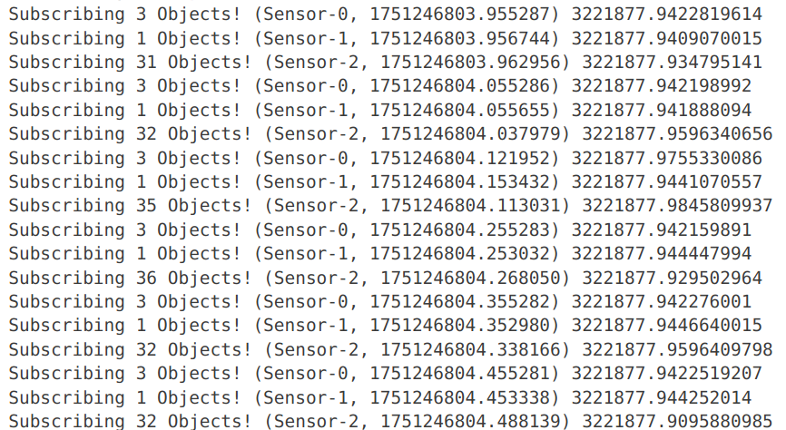

# ros2中的消息同步——message_filter & 手写改造

在多传感器融合、多模态感知的场景下，**消息同步** 是必不可少的步骤。
 不同传感器的数据频率不一致，且存在网络延迟，因此需要对它们进行**时间戳对齐**，以便融合处理。

本文分为两部分：

1. 使用 `message_filters` 提供的同步策略。
2. 手写一个通用同步器，解决 `message_filters` 的一些局限性。


# 1 message_filter

### 功能介绍

`message_filters` 是 ROS2 中提供的一组工具，用于**多话题消息同步**。

它的核心是 `Synchronizer`，支持两种常见策略：

- **ExactTime**：严格时间戳相同才触发回调。
- **ApproximateTime**：时间戳近似匹配即可触发，更适合实际传感器场景。


### 示例代码

下面的例子订阅了两个话题：`/imu`（IMU 数据）和 `/fix`（GPS 数据），并使用 **ExactTime** 策略进行同步：

```C++
#include <message_filters/subscriber.h>
#include <message_filters/synchronizer.h>
#include <message_filters/sync_policies/exact_time.h>
#include <message_filters/sync_policies/approximate_time.h>
#include <sensor_msgs/msg/imu.hpp>
#include <sensor_msgs/msg/nav_sat_fix.hpp>

using namespace sensor_msgs;
using namespace message_filters;

// 回调函数：收到同步后的 IMU + GPS 数据
void callback(const Imu::ConstSharedPtr& imu, const NavSatFix::ConstSharedPtr& gps) 
{
    std::cout << "同步数据: IMU加速度X=" << imu->linear_acceleration.x 
              << ", GPS纬度=" << gps->latitude << std::endl;
}

int main(int argc, char** argv) {
    rclcpp::init(argc, argv);
    auto node = std::make_shared<rclcpp::Node>("sync_node");

    // 订阅 IMU 和 GPS 话题
    message_filters::Subscriber<Imu> imu_sub(node, "/imu", 1);
    message_filters::Subscriber<NavSatFix> gps_sub(node, "/fix", 1);

    // 使用 ExactTime 策略，也可以替换为 ApproximateTime
    typedef sync_policies::ExactTime<Imu, NavSatFix> SyncPolicy;
    message_filters::Synchronizer<SyncPolicy> sync(SyncPolicy(10), imu_sub, gps_sub);
    sync.registerCallback(&callback);

    rclcpp::spin(node);
    rclcpp::shutdown();
    return 0;
}

```


# 2 手写同步器

### message_filters缺陷

1. **编译期固定数量**
   - 需要在模板参数里写死消息数量（如 `ExactTime<Imu, NavSatFix>`）。
   - 如果你要同步 *N* 个话题，就必须修改模板代码并重新编译。
2. **扩展性差**
   - 无法灵活支持数量不定的消息源。
   - 在多传感器（如 5 个相机 + 2 个雷达）的情况下，使用起来非常麻烦。

因此，可以写一个**通用的同步器**，在运行时动态注册任意数量的传感器，按时间戳进行近似对齐。


### 核心思路

1. 外部注册时间戳提取回调函数。因此该程序不仅可用于ros程序，还可以用于其他通讯架构，如dds等。
2. 两个核心参数：缓存大小（queue_size）和时间窗口（tolerance）。与message_filters一致。
3. 使用dfs算法，搜索窗口内最优组合。
4. 可动态调整改变某一同步主题的valid属性。


### 同步器代码

```C++
/****************************
/*	 @Date	: 2025/08/04
/*	 @Author	: YayoYY
*****************************/
#pragma once

#include <deque>
#include <vector>
#include <memory>
#include <chrono>
#include <mutex>
#include <limits>

template<typename MsgType>
class SyncApproxPolicy 
{
public:
    using QueueType = std::deque<std::shared_ptr<MsgType>>;
    using MsgTimeMsFunction = std::function<int64_t(const std::shared_ptr<MsgType>&)>;

private:
    int                         queue_size_;
    int                         tolerance_; // ms
    std::map<int, bool>         valids_;
    std::map<int, QueueType>    queues_;
    std::mutex                  mutex_;
    MsgTimeMsFunction           get_msg_time_ms;

public:
    SyncApproxPolicy(int queue_size, int tolerance_ms)
        : queue_size_(queue_size), tolerance_(tolerance_ms) {}

    void init(int num_inputs, MsgTimeMsFunction f) 
    {
        for (int i = 0; i < num_inputs; ++i) 
        {
            queues_[i] = {};
            valids_[i] = true;
        }

        get_msg_time_ms = f;
    }

    void set_invalid(int i)
    {
        valids_[i] = false;
    }

    void set_valid(int i)
    {
        valids_[i] = true;
    }

    bool get_valid(int i)
    {
        return valids_[i];
    }

    int get_valid_num()
    {
        int valid_num = 0;
        for (const auto& [idx, v] : valids_)
        {
            if (v)
            {
                valid_num += 1;
            }
        }
        return valid_num;
    }

    void add(int index, const std::shared_ptr<MsgType>& msg) 
    {
        std::lock_guard<std::mutex> lock(mutex_);
        auto& q = queues_[index];
        if (q.size() >= queue_size_)
        {
            q.pop_front();
        }
        q.push_back(msg);
    }

    bool ready(std::vector<std::shared_ptr<MsgType>>& result) 
    {
        std::lock_guard<std::mutex> lock(mutex_);
        
        // Judge queue
        if (queues_.size() == 0) 
        {
            return false;
        }

        for (const auto& [idx, q] : queues_) 
        {
            if (q.empty() && valids_[idx])
            {
                return false;
            }
        }

        // Try every combination within tolerance
        auto start = std::chrono::steady_clock::now();

        bool found = false;
        int min_dt_sum = std::numeric_limits<int>::max();
        std::vector<std::shared_ptr<MsgType>> min_result;
        std::vector<std::shared_ptr<MsgType>> temp_result;
        dfs_search(found, min_dt_sum, min_result, 0, temp_result, 0);
        if (!found)
        {
            return false;
        }

        // Collect Result and Remove used messages
        result.clear();
        int i = 0;
        for (auto it = min_result.begin(); it != min_result.end(); it++, i++)
        {
            result.push_back(*it);

            int64_t tms = get_msg_time_ms(*it);
            // std::cout << "tms (ms): " << tms << std::endl;
            
            for (auto& [j, q] : queues_)
            {
                q.erase(std::remove_if(q.begin(), q.end(), [&](const std::shared_ptr<MsgType>& m) 
                {   
                    return get_msg_time_ms(m) <= tms;
                }), q.end());
            }
        }

        auto end = std::chrono::steady_clock::now();
        auto duration = std::chrono::duration_cast<std::chrono::microseconds>(end - start).count() * 0.001;
        // std::cout << "duration: " << duration << " ms" << std::endl;

        return true;
    }

    void dfs_search(bool& found, int& min_dt_sum, std::vector<std::shared_ptr<MsgType>>& min_result,
                    int dt_sum, std::vector<std::shared_ptr<MsgType>>& temp_result, int idx)
    {
        if (idx >= queues_.size())
        {   
            if (dt_sum < min_dt_sum)
            {
                found = true;
                min_dt_sum = dt_sum;
                min_result = temp_result;

                // int i = 0;
                // for (auto it = min_result.begin(); it != min_result.end(); it++, i++)
                // {
                //     int64_t tms = get_msg_time_ms(*it);
                //     std::cout << "idx=" << i << " tms: " << tms << std::endl;
                // }
                
            }
            return;
        }

        if (!valids_[idx])
        {
            dfs_search(found, min_dt_sum, min_result, dt_sum, temp_result, idx + 1);
            return;
        }

        for (const auto& m1: queues_[idx])
        {
            int64_t dt_add = 0;
            bool obey = false;
            for (const auto& m2 : temp_result)
            {
                int64_t dt = std::abs(get_msg_time_ms(m1) - get_msg_time_ms(m2));
                if (dt >= tolerance_)
                {
                    obey = true;
                    break;
                }
                dt_add += dt;
            }

            if (obey || dt_sum + dt_add >= min_dt_sum)
            {
                continue;
            }

            temp_result.push_back(m1);
            dfs_search(found, min_dt_sum, min_result, dt_sum + dt_add, temp_result, idx + 1);
            temp_result.pop_back();
        }
    }
};

```


### 使用示例

Demo C++ 代码，功能是订阅若干数量的ROS2 的 **sensor_msgs::msg::CompressedImage** 和 **sensor_msgs::msg::PointCloud2**，将它们以jpg和pcd的格式保存到磁盘中。

```C++
/****************************
/*	 @Date	: 2025/08/20
/*	 @Author	: YayoYY
*****************************/
#include <vector>
#include <string>
#include <cmath>
#include <chrono>
#include <thread>
#include <sstream>
#include <fstream>
#include <iomanip>
#include <iostream>
#include <unistd.h> 
#include <limits.h> 
#include <rclcpp/rclcpp.hpp>
#include <sensor_msgs/msg/compressed_image.hpp>
#include <sensor_msgs/msg/point_cloud2.hpp>
#include <opencv2/opencv.hpp>
#include <pcl/point_types.h>
#include <pcl/point_cloud.h>
#include <pcl_conversions/pcl_conversions.h>
#include <pcl/io/pcd_io.h>
#include <cv_bridge/cv_bridge.h>
#include <tf2_ros/buffer.h>
#include <tf2_ros/transform_listener.h>
#include <geometry_msgs/msg/transform_stamped.hpp>
#include "syncpolicy.hpp"
using namespace std::chrono_literals;
#define SYNC_BUFFER 100
#define SYNC_CACHE_SEQ_LEN 20

// 为了实现不同类型的消息同步，定义一个通用的消息包装类
class ObjectWrapper
{
public:
    bool    img_flag; // 是否为图像
    int     i;  // 传感器索引
    std::shared_ptr<sensor_msgs::msg::CompressedImage>         img;
    std::shared_ptr<sensor_msgs::msg::PointCloud2>             pc;

public:
    ObjectWrapper() = default;

    // 图像消息构造函数
    ObjectWrapper(int index, const std::shared_ptr<sensor_msgs::msg::CompressedImage>& msg)
    {
        img_flag = true;
        i = index;
        img = msg;
    }

    // 点云消息构造函数
    ObjectWrapper(int index, const std::shared_ptr<sensor_msgs::msg::PointCloud2>& msg)
    {
        img_flag = false;
        i = index;
        pc = msg;
    }
};

// 单独定义一个获取消息时间戳的函数
int64_t get_ros_msg_time_ms(const std::shared_ptr<ObjectWrapper>& msg)
{
    int64_t res;
    if (msg->img_flag)
    {
        res = static_cast<int64_t>(msg->img->header.stamp.sec) * 1000 + static_cast<int64_t>(msg->img->header.stamp.nanosec) / 1000000;
    }
    else
    {
        res = static_cast<int64_t>(msg->pc->header.stamp.sec) * 1000 + static_cast<int64_t>(msg->pc->header.stamp.nanosec) / 1000000;
    }
    return res;
}


class SyncDownloadNode : public rclcpp::Node
{
private:
    int                         topic_num; // 订阅主题数量
    std::vector<std::string>    topic_names; // 订阅主题名
    std::vector<std::string>    topic_types; // 订阅主题类型，img或pc
    std::vector<std::string>    paths; // 存储路径

    int                                             save_idx; // id对齐
    std::map<int, double>                           last_sub_times_; // 最后订阅时间，用于心跳检查

    typedef SyncApproxPolicy<ObjectWrapper>         SyncPolicy; // 消息同步策略，ObjectWarpper为同步的消息类型
    std::shared_ptr<SyncPolicy>                     sync_; // 消息同步类

    std::vector<rclcpp::Subscription<sensor_msgs::msg::CompressedImage>::SharedPtr> img_subscribers_; // 图像订阅者
    std::vector<rclcpp::Subscription<sensor_msgs::msg::PointCloud2>::SharedPtr>     pc_subscribers_; // 激光订阅者
    rclcpp::TimerBase::SharedPtr                    sync_timer_; // 同步定时器
    rclcpp::TimerBase::SharedPtr                    check_timer_; // 消息检查定时器

public:
    SyncDownloadNode(int i_topic_num, 
        const std::vector<std::string>& i_topic_names, 
        const std::vector<std::string>& i_topic_types, 
        const std::vector<std::string>& i_paths, 
        const int& interval) : Node("sync_download_node")
    {
        save_idx = 0;

        topic_num = i_topic_num;
        topic_names = i_topic_names;
        topic_types = i_topic_types;
        paths = i_paths;

        for (int i = 0 ; i < topic_num; i++)
        {
            // 读取参数
            std::string topic_name = topic_names[i];
            std::string topic_type = topic_types[i];
            std::string path = paths[i];

            // 不同消息类型，注册各自回调函数
            if (topic_type == "img")
            {
                rclcpp::Subscription<sensor_msgs::msg::CompressedImage>::SharedPtr subscriber_;
                subscriber_ = this->create_subscription<sensor_msgs::msg::CompressedImage>(topic_name, 2,
                    [this, i](const sensor_msgs::msg::CompressedImage::SharedPtr msg) {
                        this->imgSub(i, msg);
                    });
                img_subscribers_.push_back(subscriber_);
            }

            else
            {
                rclcpp::Subscription<sensor_msgs::msg::PointCloud2>::SharedPtr subscriber_;
                subscriber_ = this->create_subscription<sensor_msgs::msg::PointCloud2>(topic_name, 2,
                    [this, i](const sensor_msgs::msg::PointCloud2::SharedPtr msg) {
                        this->pcSub(i, msg);
                    });
                pc_subscribers_.push_back(subscriber_);
            }

            // 初始化同步器
            sync_ = std::make_shared<SyncPolicy>(SYNC_CACHE_SEQ_LEN, SYNC_BUFFER); // 两个参数：队列长度，时间容忍度
            sync_->init(topic_num, get_ros_msg_time_ms); // 注册时间函数

            // 发布者初始化
            sync_timer_ = this->create_wall_timer(std::chrono::seconds(interval), std::bind(&SyncDownloadNode::sync, this)); // interval为同步间隔
            check_timer_ = this->create_wall_timer(500ms, std::bind(&SyncDownloadNode::check, this)); // 心跳检查

        }
    }
    
private:
    void imgSub(int index, const std::shared_ptr<sensor_msgs::msg::CompressedImage>& msg)
    {
        // 包装消息
        std::shared_ptr<ObjectWrapper> msg_wrapper = std::make_shared<ObjectWrapper>(index, msg);

        // 加入同步队列
        sync_->add(index, msg_wrapper);

        last_sub_times_[index] = getNowTimestamp();
        
        if (!sync_->get_valid(index))
        {
            sync_->set_valid(index);
        }
    }

    void pcSub(int index, const std::shared_ptr<sensor_msgs::msg::PointCloud2>& msg)
    {
        // 包装消息
        std::shared_ptr<ObjectWrapper> msg_wrapper = std::make_shared<ObjectWrapper>(index, msg);
        
        // 加入同步队列
        sync_->add(index, msg_wrapper);

        last_sub_times_[index] = getNowTimestamp();
        
        if (!sync_->get_valid(index))
        {
            sync_->set_valid(index);
        }
    }

    void sync()
    {
        std::vector<std::shared_ptr<ObjectWrapper>> synced;
        if (sync_->ready(synced)) // 判断是否可以同步
        {
            save(synced); // 落盘
        }
    }

    std::string generate_filename(int index, const std::string& extension)
    {
        
        std::ostringstream stream;
        stream << std::setw(6) << std::setfill('0') << index;
        return stream.str() + extension;
    }

    void save(const std::vector<std::shared_ptr<ObjectWrapper>>& msgs)
    {
        for (auto msg : msgs)
        {
            int64_t timestamp = get_ros_msg_time_ms(msg);
            if (msg->img_flag)
            {
                try 
                {
                    cv::Mat image = cv::imdecode(cv::Mat(msg->img->data), cv::IMREAD_COLOR);
                    
                    if (image.empty())
                    {
                        return;
                    }

                    std::string filename = generate_filename(save_idx, ".jpg");
                    std::string full_path = paths[msg->i] + "/" + filename;

                    if (cv::imwrite(full_path, image))
                    {
                        std::cout << "Saved image: " << full_path.c_str() << " " << timestamp << std::endl;
                    } 
                    else 
                    {
                        std::cout << "Failed to save image: " << full_path.c_str() << std::endl;
                    }
                } 

                catch (const std::exception& e) 
                {
                    std::cout << "Error saving image: " << e.what() << std::endl;
                } 
            }

            else
            {
                try 
                {
                    pcl::PointCloud<pcl::PointXYZI>::Ptr cloud(new pcl::PointCloud<pcl::PointXYZI>);
                    pcl::fromROSMsg(*(msg->pc), *cloud);

                    if (cloud->empty()) 
                    {
                        return;
                    }

                    std::string filename = generate_filename(save_idx, ".pcd");
                    std::string full_path = paths[msg->i] + "/" + filename;

                    if (pcl::io::savePCDFileBinary(full_path, *cloud) == 0)
                    {
                        std::cout << "Saved pcd: " << full_path.c_str() << " " << timestamp << std::endl;
                    } 
                    else 
                    {
                        std::cout << "Failed to save pcd: " << full_path.c_str() << std::endl;
                    }

                } 
                catch (const std::exception& e) 
                {
                    std::cout << "Error saving pcd: " << e.what() << std::endl;
                }
            }
        }

        save_idx++;
    }

    void check()
    {
        for (int i = 0; i < topic_num; i++)
        {
            double now = getNowTimestamp();
            if (now - last_sub_times_[i] > 5) // 超过5秒钟没有心跳，将同步器中的索引设为invalid
            {
                sync_->set_invalid(i);
            }

            else if (now - last_sub_times_[i] > 1)
            {
                sync_->set_invalid(i);
            }
        }
    }
};


int main(int argc, char** argv)
{   
    int topic_num = std::stoi(argv[1]);
    std::vector<std::string> topic_names;
    std::vector<std::string> topic_types;
    std::vector<std::string> paths;
    int i = 2; // 从第2个参数开始，每3个参数为一组，分别为 订阅主题名，订阅主题类型（img/pc），存储路径
    for ( ; i < topic_num * 3 + 2; )
    {
        std::string topic_name = argv[i++];
        std::string topic_type = argv[i++];
        std::string viz_topic = argv[i++];

        topic_names.push_back(topic_name);
        topic_types.push_back(topic_type);
        paths.push_back(viz_topic);
    }
    int interval = std::stoi(argv[i++]); // 同步间隔，单位秒

    rclcpp::init(argc, argv);
    auto node = std::make_shared<SyncDownloadNode>(topic_num, topic_names, topic_types, paths, interval);
    rclcpp::spin(node);
    rclcpp::shutdown();
}
```

### 使用效果

message_filter效果（3个消息一组，括号内有时间戳）



手写同步器效果（也非常接近，与message_filter差不多）



