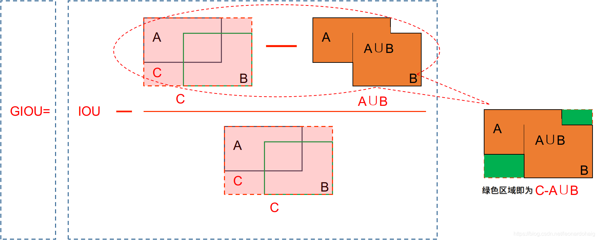

# 旋转目标GIoU计算原理与C++代码实现

# 1 定义

2D目标表示为(x, y, w, h, yaw)。3D目标表示为(x, y, z, w, h, l, yaw)。

其中 x,y(,z) 为中心点，yaw为偏航角。xyz方向为右前上，yaw为车头边与x正向夹角，取值为[-π, π]。

# 2 计算公式

## 2.1 IoU

计算公式：

$$
I O U=\frac{A \cap B}{A \cup B}
$$

**IoU**指标在无交叠时无回传梯度（**距离多远IOU都=0**），且**无法体现交叠方式**。因此有了GIOU。

## 2.2 GIoU

计算公式：

$$
G I o U=I o U-\frac{|C \backslash(A \cup B)|}{|C|}
$$

其中C为A和B的最小外接矩形。



下图是交叠面积为0时的不同情况，可看出GIoU比IoU更有区分性。


# 3 旋转情况

2D情况下，带旋转的两个矩形想计算IoU，需要先**计算旋转坐标**，再**切割多边形**（Sutherland-Hodgman算法），最后**计算多边形面积**（鞋带公式）。GIoU需要多计算一步**最大外接矩形面积**。**3D情况**需乘以对应高度。

## 3.1 计算旋转坐标

通过中心点计算四个顶点的坐标。可以先通过下图红色辅助三角形，求解A、B两个辅助点的坐标。然后再通过绿色辅助三角形，求解四个顶点的坐标。


四个顶点的公式很容易推导出来：

$$
R=\left[\begin{array}{cc}
\cos (\text { yaw }) & -\sin (\text { yaw }) \\
\sin (\text { yaw }) & \cos (\text { yaw })
\end{array}\right] \quad \text { corners }=\left[\begin{array}{cc}
\frac{w}{2} & \frac{l}{2} \\
-\frac{w}{2} & \frac{l}{2} \\
-\frac{w}{2} & -\frac{l}{2} \\
\frac{w}{2} & -\frac{l}{2}
\end{array}\right] \quad \\ \text { corners }=\left(\text { corners } \cdot R^T\right)+\left[\begin{array}{l}
x \\
y
\end{array}\right]
$$

## 3.2 Sutherland-Hodgman算法

Sutherland-Hodgman算法为多边形裁剪算法。原理是根据裁剪边在多边形内外的位置关系，替换多边形顶点序列。

裁剪边与多边形的位置关系有如下四种，各种情况下输出的替代顶点为：


举例：


判断点内外的方法是：$P=(x_2-x_1)*(y-y_1)-(y_2-y_1)*(x-x_1)$。其中(x, y)是待判断的点，另外两个点是划分内外的线段。P<0点在线右，P>0点在线左，P=0点在上。如果顶点顺时针排列，则右边为可见，左边为不可见。反之。

两线段交点求解公式：

$$
\begin{aligned}\left(P_x, P_y\right)= & \left(\frac{\left(x_1 y_2-y_1 x_2\right)\left(x_3-x_4\right)-\left(x_1-x_2\right)\left(x_3 y_4-y_3 x_4\right)}{\left(x_1-x_2\right)\left(y_3-y_4\right)-\left(y_1-y_2\right)\left(x_3-x_4\right)},\right. \\& \left.\frac{\left(x_1 y_2-y_1 x_2\right)\left(y_3-y_4\right)-\left(y_1-y_2\right)\left(x_3 y_4-y_3 x_4\right)}{\left(x_1-x_2\right)\left(y_3-y_4\right)-\left(y_1-y_2\right)\left(x_3-x_4\right)}\right)\end{aligned}
$$

## 3.3 鞋带公式

鞋带公式用于计算笛卡尔坐标系下的多边形面积。原理为顺次求解并累加多边形的每条线段与原点构成的三角形面积的差值。

由于公式形式类似鞋带而得名。


线段与原点构成的三角形面积公式为：$S=x_1y_2-x_2y_1$。可以通过下图方式做辅助四边形证到。


## 3.4 最大外接矩形面积

对于GIoU，还需求解最大外接矩形面积。最大外接矩形的对角线顶点分别为8个顶点横纵坐标的极小值和极大值**。**得到顶点即可求解面积。

## 3.5 3D情况

3D情况下，只需在BEV视角下求解2D的IoU或GIoU，再乘以对应高度即可。

对于相交体积，高度=max(底边高)-min(顶边高)。

对于最大外接立方体，高度=max(顶边高)-min(底边高)。

# 4 代码：GIoU3D实现（C++）

IoU3d.hpp

```cpp
#pragma once

#include <vector>
#include <iostream>
#include <chrono>
#include <cstdint>
#include <algorithm>
#include <cmath>
#include <tuple>

// 定义点
struct Point2D {
    float x;
    float y;
};

// 定义线（点的集合）
typedef std::vector<Point2D> Polyline2D;

// 定义3D框
struct BoundingBox3D
{
    float x;
    float y;
    float z;
    float length;
    float width;
    float height;
    float yaw;
    float classId;
};

// 旋转顶点的X坐标
inline float rotatedX(float x, float y, float angle)
{
    return x * std::cos(angle) - y * std::sin(angle);
}

// 旋转顶点的Y坐标
inline float rotatedY(float x, float y, float angle)
{
    return x * std::sin(angle) + y * std::cos(angle);
}

// 旋转矩形顶点坐标
inline Polyline2D boundingBox3DToTopDown(const BoundingBox3D &box1)
{
    Polyline2D box; 
    box.push_back({rotatedX(-0.5 * box1.width, 0.5 * box1.length,
                            box1.yaw) + box1.x, 
                   rotatedY(-0.5 * box1.width, 0.5 * box1.length,
                            box1.yaw) + box1.y}); 

    box.push_back({rotatedX(0.5 * box1.width, 0.5 * box1.length,
                            box1.yaw) + box1.x,
                   rotatedY(0.5 * box1.width, 0.5 * box1.length,
                            box1.yaw) + box1.y}); 

    box.push_back({rotatedX(0.5 * box1.width, -0.5 * box1.length,
                            box1.yaw) + box1.x, 
                   rotatedY(0.5 * box1.width, -0.5 * box1.length,
                            box1.yaw) + box1.y});

    box.push_back({rotatedX(-0.5 * box1.width, -0.5 * box1.length,
                            box1.yaw) + box1.x, 
                   rotatedY(-0.5 * box1.width, -0.5 * box1.length,
                            box1.yaw) + box1.y}); 

    return box;
}

// 两条线段交点X坐标
inline float xIntersect(float x1, float y1, float x2, float y2,
                     float x3, float y3, float x4, float y4)
{
    float num = (x1*y2 - y1*x2) * (x3-x4) - (x1-x2) * (x3*y4 - y3*x4);
    float den = (x1-x2) * (y3-y4) - (y1-y2) * (x3-x4);
    return num/den;
}

// 两条线段交点Y坐标
inline float yIntersect(float x1, float y1, float x2, float y2,
                     float x3, float y3, float x4, float y4)
{
    float num = (x1*y2 - y1*x2) * (y3-y4) - (y1-y2) * (x3*y4 - y3*x4);
    float den = (x1-x2) * (y3-y4) - (y1-y2) * (x3-x4);
    return num/den;
}

// Sutherland-Hodgman算法中顶点判断与替换
inline Polyline2D clip(const Polyline2D &poly_points,
                float x1,
                float y1,
                float x2,
                float y2)
{
    Polyline2D new_points;

    for (size_t i = 0; i < poly_points.size(); i++)
    {
        // (ix,iy),(kx,ky) are the co-ordinate values of the points
        // i and k form a line in polygon
        size_t k = (i+1) % poly_points.size();
        float ix = poly_points[i].x, iy = poly_points[i].y;
        float kx = poly_points[k].x, ky = poly_points[k].y;

        // Calculating position of first point w.r.t. clipper line
        float i_pos = (x2-x1) * (iy-y1) - (y2-y1) * (ix-x1);

        // Calculating position of second point w.r.t. clipper line
        float k_pos = (x2-x1) * (ky-y1) - (y2-y1) * (kx-x1);

        // Case 1 : When both points are inside
        if (i_pos < 0  && k_pos < 0)
        {
            //Only second point is added
            new_points.push_back({kx,ky});
        }

            // Case 2: When only first point is outside
        else if (i_pos >= 0  && k_pos < 0)
        {
            // Point of intersection with edge
            // and the second point is added
            new_points.push_back({xIntersect(x1, y1, x2, y2, ix, iy, kx, ky),
                                  yIntersect(x1, y1, x2, y2, ix, iy, kx, ky)});
            new_points.push_back({kx,ky});

        }

            // Case 3: When only second point is outside
        else if (i_pos < 0  && k_pos >= 0)
        {
            //Only point of intersection with edge is added
            new_points.push_back({xIntersect(x1, y1, x2, y2, ix, iy, kx, ky),
                                  yIntersect(x1, y1, x2, y2, ix, iy, kx, ky)});

        }
            // Case 4: When both points are outside
        else
        {
            //No points are added
        }
    }

    return new_points;
}

// Sutherland-Hodgman算法
inline Polyline2D sutherlandHodgmanClip(const Polyline2D &poly_points_vector,
                                 const Polyline2D &clipper_points)
{
    Polyline2D clipped_poly_points_vector = poly_points_vector;
    for (size_t i=0; i<clipper_points.size(); i++)
    {
        size_t k = (i+1) % clipper_points.size(); //i and k are two consecutive indexes

        // We pass the current array of vertices, and the end points of the selected clipper line
        clipped_poly_points_vector = clip(clipped_poly_points_vector, clipper_points[i].x, clipper_points[i].y,
                                          clipper_points[k].x, clipper_points[k].y);
    }
    return clipped_poly_points_vector;
}

// 多边形面积
inline float polygonArea(const Polyline2D &polygon)
{
    float area = 0.0;

    size_t j = polygon.size()-1;
    for (size_t i = 0; i < polygon.size(); i++)
    {
        area += (polygon[j].x + polygon[i].x) * (polygon[j].y - polygon[i].y);
        j = i;  // j is previous vertex to i
    }

    return std::abs(area / 2.0); // Return absolute value
}

// 最大外接矩形面积
inline Polyline2D getBoundingBox(const Polyline2D &polygon)
{
    float minX = std::numeric_limits<float>::max();
    float minY = std::numeric_limits<float>::max();
    float maxX = std::numeric_limits<float>::lowest();
    float maxY = std::numeric_limits<float>::lowest();

    for (const auto &point : polygon)
    {
        minX = std::min(minX, point.x);
        minY = std::min(minY, point.y);
        maxX = std::max(maxX, point.x);
        maxY = std::max(maxY, point.y);
    }

    Polyline2D boundingBox;
    boundingBox.push_back({minX, minY});
    boundingBox.push_back({maxX, minY});
    boundingBox.push_back({maxX, maxY});
    boundingBox.push_back({minX, maxY});

    return boundingBox;
}

// IoU3D
inline float iou3D(const BoundingBox3D& box1,
          const BoundingBox3D& box2)
{
    const auto& box_as_vector = boundingBox3DToTopDown(box1);
    const auto& box_as_vector_2 = boundingBox3DToTopDown(box2);
    const auto& clipped_vector = sutherlandHodgmanClip(box_as_vector, box_as_vector_2);

    float volume_poly1 = polygonArea(box_as_vector) * box1.height;
    float volume_poly2 = polygonArea(box_as_vector_2) * box2.height;

    float box1_top_z = box1.z + box1.height / 2;
    float box1_bottom_z = box1.z - box1.height / 2;
    float box2_top_z = box2.z + box2.height / 2;
    float box2_bottom_z = box2.z - box2.height / 2;

    float topZ = std::min(box1_top_z, box2_top_z);
    float bottomZ = std::max(box1_bottom_z, box2_bottom_z);
    float z_overlap = topZ - bottomZ;

    float area_overlap = polygonArea(clipped_vector);
    float volume_overlap = 0.0f;

    if (z_overlap > 0.0f && area_overlap > 0.0f) {
        volume_overlap = area_overlap * z_overlap;
    }

    float iou = 0.0f;
    float volume_union = volume_poly1 + volume_poly2 - volume_overlap;
    if (volume_union > 0.0f) {
        iou = volume_overlap / volume_union;
    }

    return iou;
}

// GIoU3D
inline float giou3D(const BoundingBox3D& box1, const BoundingBox3D& box2) {
    const auto& box_as_vector = boundingBox3DToTopDown(box1);
    const auto& box_as_vector_2 = boundingBox3DToTopDown(box2);
    const auto& clipped_vector = sutherlandHodgmanClip(box_as_vector, box_as_vector_2);

    float volume_poly1 = polygonArea(box_as_vector) * box1.height;
    float volume_poly2 = polygonArea(box_as_vector_2) * box2.height;

    float box1_top_z = box1.z + box1.height / 2;
    float box1_bottom_z = box1.z - box1.height / 2;
    float box2_top_z = box2.z + box2.height / 2;
    float box2_bottom_z = box2.z - box2.height / 2;

    float topZ = std::min(box1_top_z, box2_top_z);
    float bottomZ = std::max(box1_bottom_z, box2_bottom_z);
    float z_overlap = topZ - bottomZ;

    float area_overlap = polygonArea(clipped_vector);
    float volume_overlap = 0.0f;

    if (z_overlap > 0.0f && area_overlap > 0.0f) {
        volume_overlap = area_overlap * z_overlap;
    }

    float volume_union = volume_poly1 + volume_poly2 - volume_overlap;
    float iou = 0.0f;
    if (volume_union > 0.0f) {
        iou = volume_overlap / volume_union;
    }

    Polyline2D union_polygon = box_as_vector;
    union_polygon.insert(union_polygon.end(), box_as_vector_2.begin(), box_as_vector_2.end());
    Polyline2D bounding_box = getBoundingBox(union_polygon);

    float bounding_top_z = std::max(box1_top_z, box2_top_z);
    float bounding_bottom_z = std::min(box1_bottom_z, box2_bottom_z);
    float bounding_height_z = bounding_top_z - bounding_bottom_z;

    float volume_bounding_box = polygonArea(bounding_box) * bounding_height_z;

    float giou = iou;
    if (volume_bounding_box > 0.0f) {
        giou -= (volume_bounding_box - volume_union) / volume_bounding_box;
    }

    return giou;
}
```

# Ref

- [CSDN：IOU和GIOU](https://blog.csdn.net/leonardohaig/article/details/103394369)
- [Github: 3D-IOU-Python](https://github.com/open-mmlab/OpenPCDet/blob/8cacccec11db6f59bf6934600c9a175dae254806/pcdet/datasets/once/once_eval/evaluation.py#L316)
- [Github: 3D-IOU-C++](https://github.com/tjtanaa/PointPillars/blob/78c8d8f907ba364136b6615986ac80dbec81390d/src/point_pillars.cpp#L365)
- [CSDN：Sutherland–Hodgman 算法介绍(简单易懂)](https://blog.csdn.net/m0_56494923/article/details/128512626)
- [CSDN：GIS算法：利用鞋带定理（Shoelace formula）求2D多边形面积](https://blog.csdn.net/xza13155/article/details/112118676)