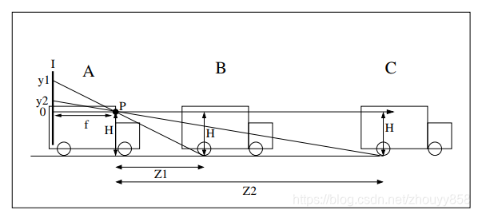
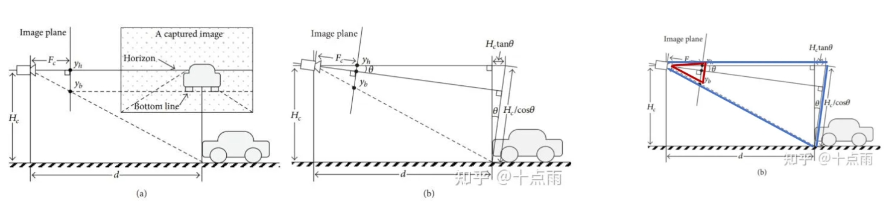

# 带pitch角的单目测距（附C++代码）


## 不带pitch角

mobileye2003年的论文：**[Vision-based ACC with a Single Camera: Bounds on Range and Range Rate Accuracy](http://www.cs.huji.ac.il/~shashua/papers/IV2003.pdf)**

**假设：**地面平坦。相机光轴与路面平行。

**原理：**相似三角形



A是本车，前方车B和C。摄像头P，焦距f，摄像头高度H，和障碍物B、C的距离分别是Z1、Z2。B、C检测框着地点在图像的投影是y1、y2。

按照相似三角形可以得出：Z=fH/y。其中f是焦距，从内参获取。H为相机高度，人为配置。y=yb-cy。cy是光心纵坐标，从内参获取。yb为检测框下底边像素纵坐标值。由于平行假设，光心对准地面无穷远点，车是贴地的，不会高于地面无穷远点，反应到像素上yb一定比cy大。

**误差结论：**640x480分辨率的图像，90m的测距误差比例为10%左右，45m的测距误差比例为5%左右。


## 带pitch角

同不带pitch角的测距，可从最右边图的相似三角形得到公式。



根据右手法则，正pitch低头，退回多余的距离（ $tan(\theta)$>0）。负pitch抬头，补偿多余的距离（ $tan(\theta)$<0）。yb是检测框下底边像素位置，yh是地面像素位置。深度：

$$ d=\frac{1}{\cos ^2 \theta} \cdot \frac{F_c \cdot H_c}{y_b-y_h}-H_c \tan \theta $$

yh的获取方式：点的物理世界坐标为(x, y, z, 1)，无穷远点z=∞，同除z，得(x/z, y/z, 1, 1/z) = (x/∞, y/∞, 1, 1/∞) = (0, 0, 1, 0)。假设相机内参为K，外参为[R, t]。该外参只包含俯仰角（绕x轴旋转，注意正负，矩阵为右下角块矩阵）和高度值，那么，求解无穷远点yh的公式为：

```python
inf_point = np.array([0, 0, 1, 0])
inf_point_uvc = K @ [R, t] @ inf_point
yh = inf_point_uvc[1] / inf_point_uvc[2]
```


## 完整C++代码

```C++

#include <cmath>
#include "Eigen/Dense"

void Coordinates::DepthEstimatePitch(float yb, float& depth)
{	
    // yb: 检测框下边纵坐标像素值 [输入]
    // depth: 深度值 [输出]
    
    // mCameraMatrix_: 4x4内参矩阵
    // mCameraPitch_: pitch角
    // mCameraHeight_: 相机安装高度
    
    // 求无穷远点的像素坐标
    float pitch = mCameraPitch_ * M_PI / 180.0f;
    Eigen::Matrix<float, 3, 4> extrinsic;
    extrinsic << 1.0, 0.0, 0.0, 0.0,
                0.0, std::cos(pitch), -std::sin(pitch), 0.0,
                0.0,  std::sin(pitch),std::cos(pitch), mCameraHeight_;
    Eigen::Matrix<float, 4, 1> inf_point(0, 0, 1, 0);
    Eigen::Vector3f inf_point_uvc =  mCameraMatrix_ * extrinsic * inf_point;
    
    // 求深度
    float f = mCameraMatrix_(1, 1);
    float yh = inf_point_uvc(1) / inf_point_uvc(2);
    float H = mCameraHeight_;
    depth = H * f / (yb - yh) / std::pow(std::cos(pitch), 2) - H * std::tan(pitch); // 地面一定比相机低
}
```


## Ref

- https://blog.csdn.net/zhouyy858/article/details/100096415
- https://zhuanlan.zhihu.com/p/419816311