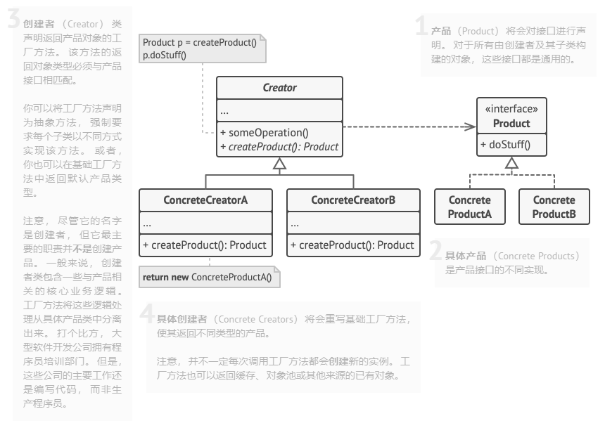

# 创建型设计模式（附C++代码）

**原文链接**：[https://refactoringguru.cn/design-patterns](https://refactoringguru.cn/design-patterns)

### 单例

目的：

- 只存在唯一一个对象。
- 需要集中某个逻辑在一个class里。
- 共享资源，如数据库或文件。
- 任何地方都可以被访问。

热度：使用正在减少。

代码示例（线程安全单例）：

```cpp
#include <iostream>
#include <mutex>
#include <string>

class Singleton 
{
public:
    // 获取单例实例
	  // C++11保证局部静态变量初始化线程安全
    static Singleton& getInstance() 
    {
        static Singleton instance;  
        return instance;
    }

    // 设置数据
    void setData(const std::string& data) 
    {
        std::lock_guard<std::mutex> lock(mutex_);
        data_ = data;
    }

    // 获取数据
    std::string getData() const 
    {
        std::lock_guard<std::mutex> lock(mutex_);
        return data_;
    }

    // 删除拷贝构造函数和赋值运算符
    Singleton(const Singleton&) = delete;
    Singleton& operator=(const Singleton&) = delete;

    // 示例方法
    void print() const 
    {
        std::cout << "Singleton data: " << data_ << std::endl;
    }

private:
    // 私有构造函数
    Singleton() : data_("Default Data") {};

    // 私有析构函数
    ~Singleton() {};

    std::string data_;
    mutable std::mutex mutex_;  // 可变mutex，用于const成员函数
};

int main() 
{
    // 获取单例实例
	  // Singleton&是引用，定义时必须被初始化，不能为nullptr，调用用.
    Singleton& s1 = Singleton::getInstance();
    Singleton& s2 = Singleton::getInstance();

    // 测试是否是同一个实例
    std::cout << "Address of s1: " << &s1 << std::endl;
    std::cout << "Address of s2: " << &s2 << std::endl;
    std::cout << "Same instance? " << (&s1 == &s2 ? "Yes" : "No") << std::endl;

    // 测试数据共享
    s1.setData("First Data");
    std::cout << "s1 data: " << s1.getData() << std::endl;
    std::cout << "s2 data: " << s2.getData() << std::endl;

    // 修改数据
    s2.setData("Second Data");
    std::cout << "After modification:" << std::endl;
    s1.print();
    s2.print();
    return 0;
}
```

```jsx
Singleton instance created
Address of s1: 0x404200
Address of s2: 0x404200
Same instance? Yes
s1 data: First Data
s2 data: First Data
After modification:
Singleton data: Second Data
Singleton data: Second Data
Singleton instance destroyed
```

### 工厂方法模式



目的：

- 解耦类的创建和调用。
- 调用方无需知道自己调用什么类，只调用通用接口实现操作。

代码示例：

```cpp
#include <iostream>
#include <string>

class Product 
{
public:
		// 不同的产品重载具体方法
    virtual void Operation() = 0; 
};

class Product1 : public Product 
{
public:
    void Operation() override 
		{
        std::cout << "product1 opration" << std::endl;
    }
};

class Product2 : public Product {
public:
    void Operation() override 
		{
        std::cout << "product2 opration" << std::endl;
    }
};

class Creator {
public:
		// 具体工厂生产具体产品
    virtual Product* FactoryMethod() = 0; 

    void SomeOperation () 
		{
				// 调用抽象工厂方法，得到抽象产品
				// 由于重载。实际调用的是具体工厂方法
        Product* product = this->FactoryMethod();
        // 调用抽象方法
        // 由于重载，实际调用的是具体方法
        product->Operation();
    }
};

class Creator1 : public Creator 
{
public:
    Product* FactoryMethod() override 
	{
        return new Product1();
    }
};

class Creator2 : public Creator 
{
public:
    Product* FactoryMethod() override 
	{
        return new Product2();
    }
};

void ClientCode(Creator& creator) 
{
    creator.SomeOperation();
}

int main() 
{
		// 创建
    Creator* creator1 = new Creator1();
    // 调用
    // 调用者不知道具体是哪个工厂类/产品类
    ClientCode(*creator1);
    
    Creator* creator2 = new Creator2();
    ClientCode(*creator2);

    return 0;
}
```

### 抽象工厂


目的：

- 为一组统一风格的产品，建立一个统一的工厂管理，以便在使用它们的时候，不会出现风格错配的情况。
- 如，维多利亚工厂，生产维多利亚风格的桌子、椅子和沙发；简约工厂，生产简约风格的桌子、椅子和沙发。

```cpp
#include <iostream>
#include <string>

class ProductA 
{
public:
    virtual std::string FunctionA() const = 0;
};

class ProductA1 : public ProductA 
{
public:
    std::string FunctionA() const override
    {
        return "产品A1";
    }
};

class ProductA2 : public ProductA 
{
public:
    std::string FunctionA() const override 
    {
        return "产品A2";
    }
};

class ProductB 
{
public:
    virtual std::string FunctionB() const = 0;
	// B与A配对协作，只有风格一致的变体才能协作
    virtual std::string CollaborateFunctionB(const ProductA &collaborator) const = 0;
};

class ProductB1 : public ProductB 
{
public:
    std::string FunctionB() const override 
    {
        return "产品B1";
    }

    std::string CollaborateFunctionB(const ProductA &collaborator) const override 
    {
        const std::string result = collaborator.FunctionA();
        return "B1与(" + result + ")协作";
    }
};

class ProductB2 : public ProductB 
{
public:
    std::string FunctionB() const override 
    {
        return "产品B2";
    }

    std::string CollaborateFunctionB(const ProductA &collaborator) const override {
        const std::string result = collaborator.FunctionA();
        return "B2与(" + result + ")协作";
    }
};

// 抽象工厂接口声明一组风格一致但品类不同的产品的方法
class Factory 
{
public:
    virtual ProductA* CreateProductA() const = 0; 
    virtual ProductB* CreateProductB() const = 0; 
};

class Factory1 : public Factory 
{
public:
    ProductA* CreateProductA() const override 
    {
        return new ProductA1();
    }
    
    ProductB* CreateProductB() const override 
    {
        return new ProductB1();
    }
};

class Factory2 : public Factory 
{
public:
    ProductA* CreateProductA() const override 
    {
        return new ProductA2();
    }
    
    ProductB* CreateProductB() const override 
    {
        return new ProductB2();
    }
};

void ClientCode(const Factory &factory) 
{
    const ProductA *product_a = factory.CreateProductA();
    const ProductB *product_b = factory.CreateProductB();
    std::cout << product_b->FunctionB() << "\n";
    std::cout << product_b->CollaborateFunctionB(*product_a) << "\n";
}

int main() 
{
    Factory1 *f1 = new Factory1();
    ClientCode(*f1);
    
    Factory2 *f2 = new Factory2();
    ClientCode(*f2);
    
    return 0;
}
```

### 生成器模式


目的：

- 不同产品的构造可选多个配置，可以拆分成多个阶段构造。
- 构造过程复杂。

```cpp
#include <iostream>
#include <vector>
#include <string>

class Product 
{
public:
    std::vector<std::string> parts_;  // 产品部件集合
    
    void ListParts() const {
        std::cout << "parts: ";
        for (size_t i = 0; i < parts_.size(); i++) 
				{
            if (parts_[i] == parts_.back()) 
							{
                std::cout << parts_[i];
            } 
						else 
						{
                std::cout << parts_[i] << ", ";
	           }
        }
        std::cout << "\n\n"; 
    }
};

class Builder
{
private:
    Product* product;

public:
    Builder() { this->Reset(); }

    void Reset() { this->product = new Product(); }

    void ProducePartA() const 
	  {
        this->product->parts_.push_back("A1");
    }

    void ProducePartB() const 
	  {
        this->product->parts_.push_back("B1");
    }

    void ProducePartC() const 
  	{
        this->product->parts_.push_back("C1");
    }

    Product* GetProduct() 
    {
        Product* result = this->product;
        this->Reset();
        return result;
    }
};

// 指挥者仅负责按特定顺序执行构建步骤
class Director {
private:
    Builder* builder;

public:
    void set_builder(Builder* builder) 
    {
        this->builder = builder;
    }

    // 构建：最小可行产品
    void BuildMinimalViableProduct() 
    {
        this->builder->ProducePartA();
    }
    
    // 构建：全功能产品
    void BuildFullFeaturedProduct() 
    {
        this->builder->ProducePartA();
        this->builder->ProducePartB();
        this->builder->ProducePartC();
    }
};

void ClientCode(Director& director) 
{
    Builder* builder = new Builder();
    director.set_builder(builder);
    
    std::cout << "最小可行产品:\n"; 
    director.BuildMinimalViableProduct();
    Product* p = builder->GetProduct();
    p->ListParts();

    std::cout << "全功能产品:\n"; 
    director.BuildFullFeaturedProduct();
    p = builder->GetProduct();
    p->ListParts();

    // builder也可以不使用director
    std::cout << "自定义产品:\n";
    builder->ProducePartA();
    builder->ProducePartC();
    p = builder->GetProduct();
    p->ListParts();
}

int main() 
{
    Director* director = new Director();
    ClientCode(*director);
    return 0;    
}
```
