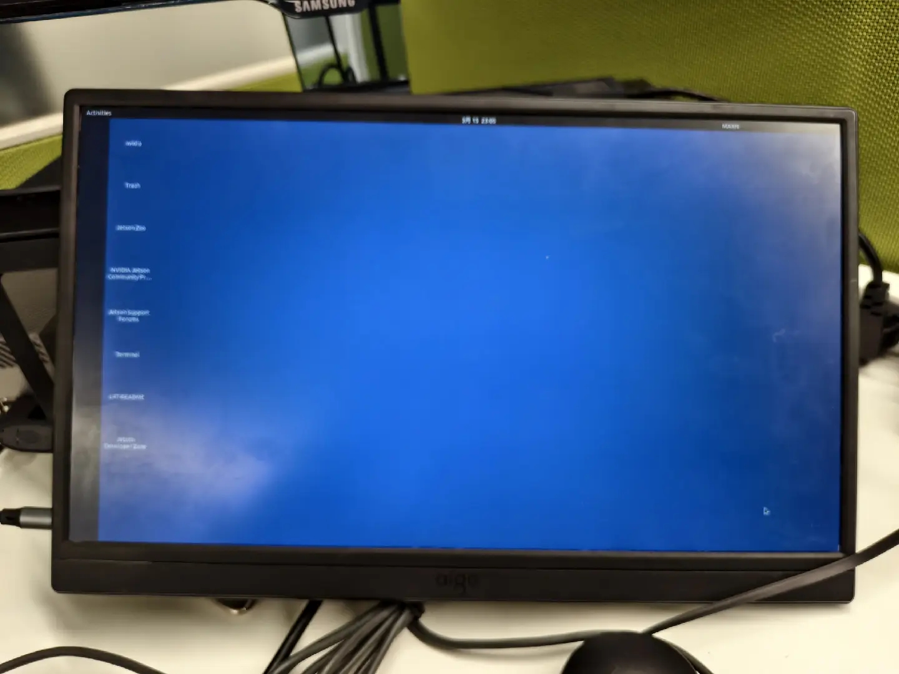
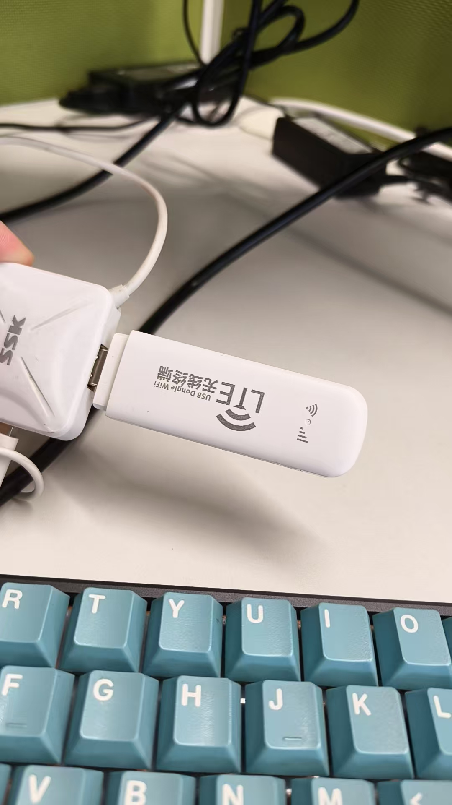

# Nvidia Jetson AGX Orin安装软件后重启蓝屏问题解决

## 背景

公司新到了一批Nvidia Jetson AGX Orin，需要安装ros2-foxy、opencv4.10、pcl1.10等环境。

由于网络环境比较受限，所以一开始打算使用离线安装方案。先在联网环境中下载ros-foxy相关的离线安装包（.deb文件），通过```sudo dpkg -i *.deb```安装ros，再通过源码编译安装opencv和pcl。

离线安装ros的过程中，由于.deb依赖不完整，导致了图形用户界面蓝屏。桌面能够显示，但为战损版蓝色（如下图所示）。登录、关机功能好用。设置、终端、文件等功能无法打开（鼠标一直转圈）。




## 解决

首先，通过tty或ssh进入到命令行。我遇到的情况是，CTRL+ALT+F1~F7都无法进入tty，电脑黑屏。此前也没有配置过手动IP，无法通过网线ssh。但我有一个USB无线终端，将它插到AGX Orin上，另一台Linux主机通过WIFI连入同一网络，通过arp-scan找到AGX的IP，就可以ssh了。

```shell
sudo apt install arp-scan 
sudo arp-scan --interface=eth0 --localnet
```



然后，修复安装依赖问题，界面就会恢复。不需要重启gdm3。

```shell
sudo apt --fix-broken install
```


## 排查

如何确定是.deb依赖不完整导致的蓝屏？

1. ```sudo dpkg -i *.deb```时出现报错，当时没在意。

2. 对比好坏两台机器的```cat /var/log/Xorg.0.log | grep "EE\|WW"```，输出一致。

3. 对比好坏两台机器的```sudo dpkg -l```，发现同样的包，坏了的机器上第一列是"iU"（已安装未配置），好的机器状态为"ii"，得出结论。

   ```
   ...
   ii  accountsservice                                 0.6.55-0ubuntu12~20.04.5             arm64        query and manipulate user account information
   ii  acl                                             2.2.53-6                             arm64        access control list - utilities
   ii  adduser                                         3.118ubuntu2                         all          add and remove users and groups
   ii  adwaita-icon-theme                              3.36.1-2ubuntu0.20.04.2              all          default icon theme of GNOME (small subset)
   ii  adwaita-icon-theme-full                         3.36.1-2ubuntu0.20.04.2              all          default icon theme of GNOME
   ...
   ```

   

