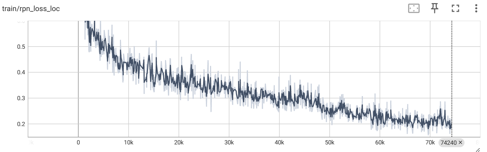
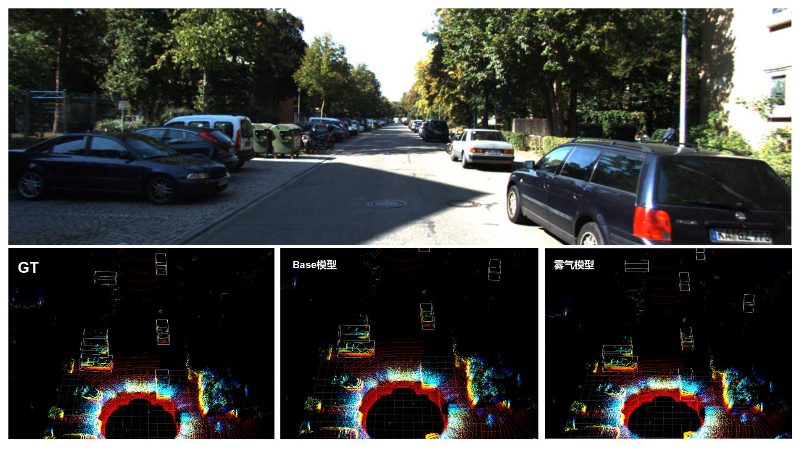
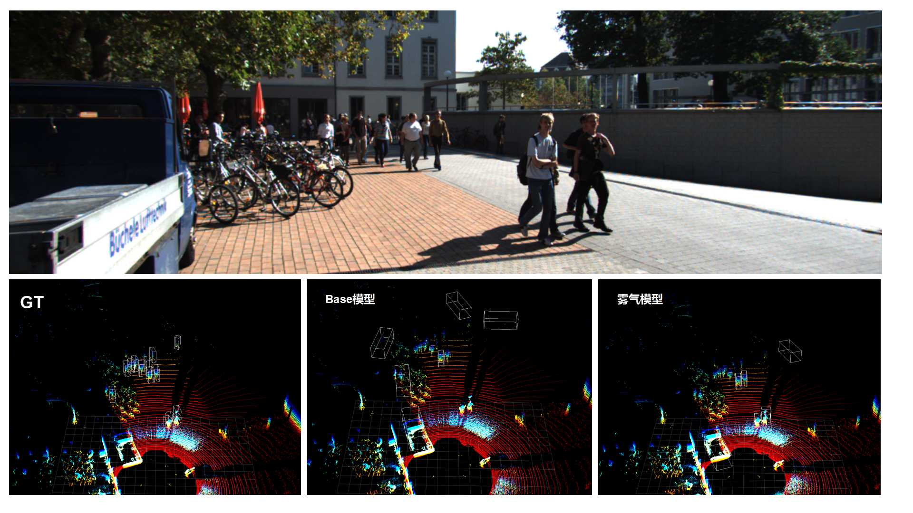

# OpenPCDet训练环境搭建与雾天模拟数据微调PointPillar

## 背景

纵观[KITTI 3D检测排行榜](https://www.cvlibs.net/datasets/kitti/eval_object.php?obj_benchmark=3d)，PointPillar虽然精度不高，但在速度方面无人能敌。对于场景不那么复杂的感知系统，配合相机、毫米波等其他传感器的后融合算法，选择PointPillar作为激光推理模型，显得很有性价比。

本文介绍KITTI数据集从0-1训练PointPillar，以及使用模拟雾气数据对模型进行微调，增强其在极端天气的鲁棒性。内容较为基础，适合初级玩家。

## OpenPCDet环境

[OpenPCDet](https://github.com/open-mmlab/OpenPCDet/tree/master)提供的docker过于老旧。

能够跑通的版本对应关系：
- 显卡：RTX 4090
- Driver Version: 535.171.04 / 580.82.07
- Cuda compiler drive: cuda_11.8
- Python: 3.10.11
- Pytorch: 2.0.1+cu118
- Spconv: spconv-cu118==2.3.8

框架正确性检验，重训Base模型指标检验：
- 数据：KITTI，Velodyne HDL64E，train(3712)，val(3769), test(7518)
- 训练时长与loss曲线：80 Epochs, 单卡6.5h，8卡0.5h

     

- 相同的配置下，效果指标与README.md有差异，特别体现在Pedestrian类别上。这里阅读了每一个与复现相关的Issue，尝试了各种方法也没有复现出它的效果。
    ```
      Car AP@0.70, 0.70, 0.70:
      bbox AP:90.7002, 89.1555, 87.6411
      bev  AP:89.6369, 86.8687, 83.3209
      3d   AP:84.7462, 75.9596, 71.8104
      aos  AP:90.65, 88.89, 87.21
      Car AP_R40@0.70, 0.70, 0.70:
      bbox AP:95.3235, 91.4571, 88.7459
      bev  AP:91.9253, 87.8353, 85.0963
      3d   AP:86.8493, 75.7582, 72.5021
      aos  AP:95.26, 91.16, 88.31
      Car AP@0.70, 0.50, 0.50:
      bbox AP:90.7002, 89.1555, 87.6411
      bev  AP:90.7568, 89.9027, 89.1626
      3d   AP:90.7534, 89.8008, 88.9232
      aos  AP:90.65, 88.89, 87.21
      Car AP_R40@0.70, 0.50, 0.50:
      bbox AP:95.3235, 91.4571, 88.7459
      bev  AP:95.5049, 94.3978, 93.4504
      3d   AP:95.4736, 94.1125, 91.5122
      aos  AP:95.26, 91.16, 88.31
      Pedestrian AP@0.50, 0.50, 0.50:
      bbox AP:65.7076, 60.1427, 57.2841
      bev  AP:58.5446, 52.6254, 48.0309
      3d   AP:53.0276, 46.3071, 41.8934
      aos  AP:45.49, 42.11, 40.32
      Pedestrian AP_R40@0.50, 0.50, 0.50:
      bbox AP:66.0256, 60.0657, 56.6510
      bev  AP:58.4682, 51.2153, 46.5222
      3d   AP:51.4326, 44.5409, 39.8439
      aos  AP:43.27, 39.19, 36.92
      Pedestrian AP@0.50, 0.25, 0.25:
      bbox AP:65.7076, 60.1427, 57.2841
      bev  AP:71.5410, 66.7663, 63.0303
      3d   AP:71.4882, 66.5201, 62.8052
      aos  AP:45.49, 42.11, 40.32
      Pedestrian AP_R40@0.50, 0.25, 0.25:
      bbox AP:66.0256, 60.0657, 56.6510
      bev  AP:72.5700, 67.2998, 63.4866
      3d   AP:72.5014, 66.8991, 63.2064
      aos  AP:43.27, 39.19, 36.92
      Cyclist AP@0.50, 0.50, 0.50:
      bbox AP:84.3031, 73.4071, 69.2048
      bev  AP:82.3594, 65.4613, 61.9682
      3d   AP:80.4068, 62.9910, 59.7200
      aos  AP:83.31, 71.26, 67.10
      Cyclist AP_R40@0.50, 0.50, 0.50:
      bbox AP:86.9608, 74.6731, 70.3900
      bev  AP:85.0299, 66.2311, 61.6405
      3d   AP:82.5636, 63.2036, 58.6239
      aos  AP:85.90, 72.33, 67.95
      Cyclist AP@0.50, 0.25, 0.25:
      bbox AP:84.3031, 73.4071, 69.2048
      bev  AP:84.4054, 72.7813, 67.3745
      3d   AP:84.3875, 72.4504, 67.1715
      aos  AP:83.31, 71.26, 67.10
      Cyclist AP_R40@0.50, 0.25, 0.25:
      bbox AP:86.9608, 74.6731, 70.3900
      bev  AP:87.3615, 72.9820, 68.2792
      3d   AP:87.3504, 72.7941, 68.1867
      aos  AP:85.90, 72.33, 67.95
   ```

一些报错及解决：

- 报错1：train.py: error: unrecognized arguments: --local-rank=4

   解决：train.py中的local_rank改为local-rank

- 报错2："OSError: [Errno 28] No space left on device"（单卡）  " exitcode : -7"（多卡）

   解决：docker run的时候加上shm_size=64G


## 雾天模拟数据

方法：
- Paper(Cited by 275)：Fog Simulation on Real LiDAR Point Clouds for 3D Object Detection in Adverse Weather
- Github(Star 228)：https://github.com/MartinHahner/LiDAR_fog_sim?tab=readme-ov-file

原理：对雾天激光点云回波的过程进行物理模拟。两类目标，hard target为目标物体，soft target为雾粒点云。对于原始点云中的每个点，算法会对比hard target衰减后的信号强度与soft target的散射信号强度。如果雾的散射更强，该点就会被替换为一个距离更近、带有噪声的虚假回波点。如果物体反射更强，则仅保留原位置并降低其反射强度。总体效果表现为，远处点消失、雾粒杂点变多、点云强度变弱。使用该方法处理晴天数据训练模型，在真实雾天预测性能指标达到SOTA效果，且在晴天场景下的性能指标没有下降。算法只有4个参数，主要参数为MOR能见度。

数据集构建：对KITTI数据集，每个样本均匀采样MOR参数值，取值范围如下，构成KITTI_FOGSIM数据集。各能见度在样本中的分布，训练集和验证集都大致均匀：
```
能见度MOR/m ∈ [600, 300, 150, 100, 50, 30, 25, 20, 15]

train ({15: 426, 20: 409, 25: 413, 30: 385, 50: 430, 100: 421, 150: 431, 300: 397, 600: 400})
val   ({15: 399, 20: 423, 25: 419, 30: 447, 50: 402, 100: 411, 150: 401, 300: 435, 600: 432})
```


## 微调PointPillar

- 模型：以Base模型权重为初始权重
- 数据：KITTI_FOG，train(3712)，val(3769)
- 训练时长：40 Epochs，15min
- 模型性能：    

    ```
                         KITTI(正常天气)                    KITTI_FOGSIM(雾天天气)
                       Base模型        雾天模型            Base模型        雾天模型
    Recall@0.5         86.8479         88.1479            80.7894        83.5087
    车AP40@0.7-M       75.7582         75.7733            72.0092        72.7880
    人AP40@0.5-M       44.5409         44.0013            31.7984        32.5971
    ```
    - 雾天特性：Base模型在雾天性能急剧下降，召回-6pp，车AP值-3pp，人AP值-13pp。
    - 雾天模型：不拉低正常天气精度。雾天天气相比Base模型，召回+3pp，人AP值+1pp。


 

