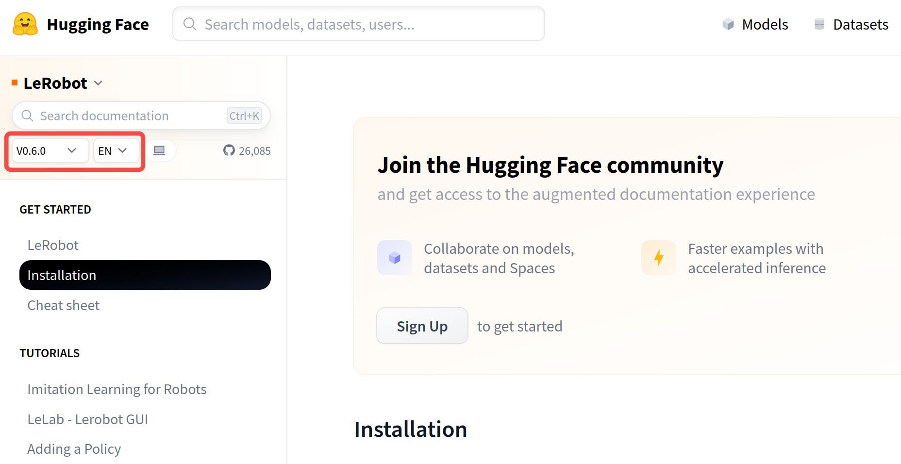
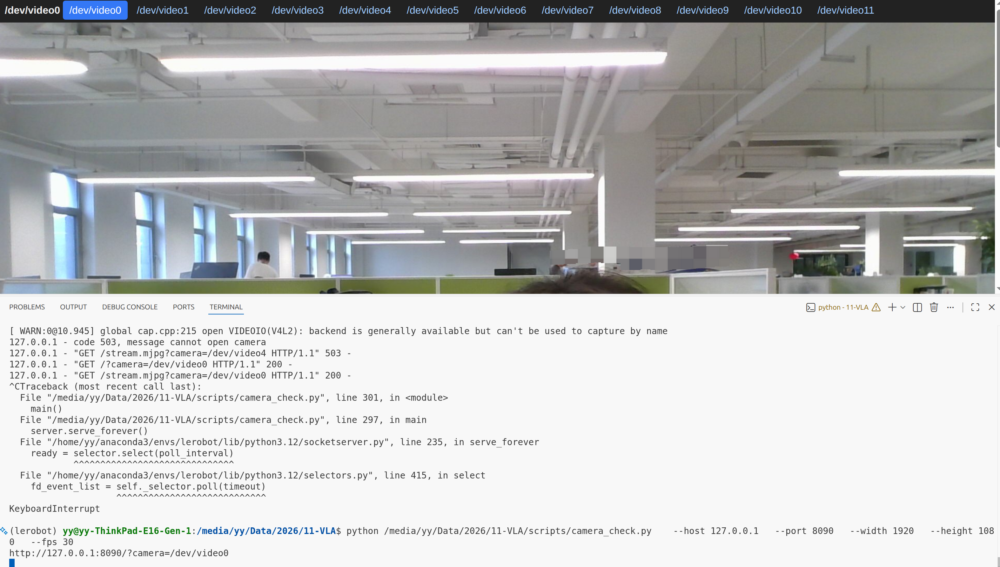
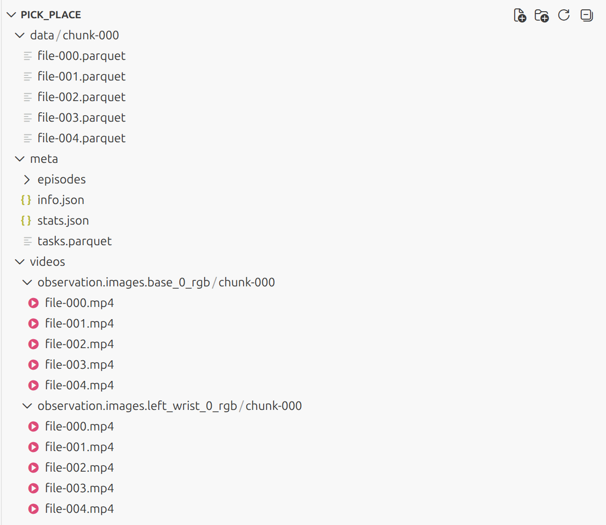
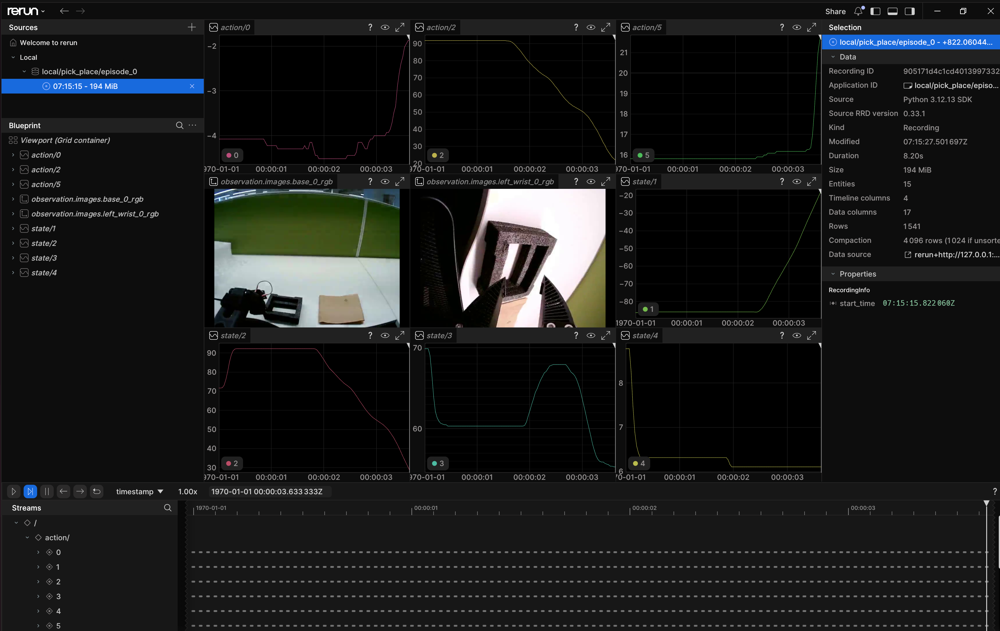
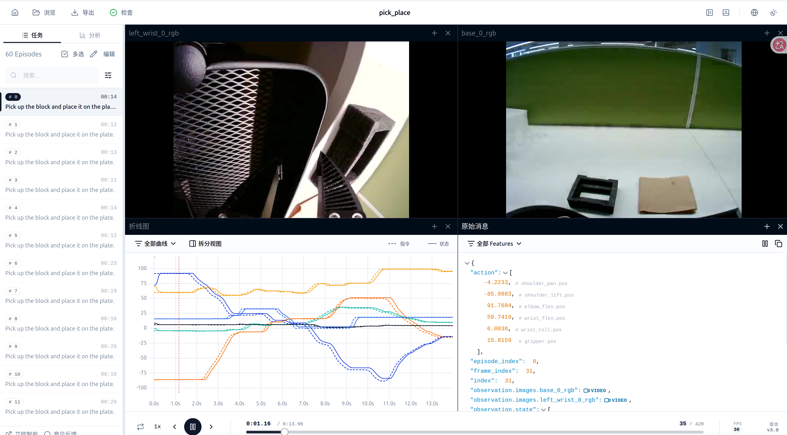
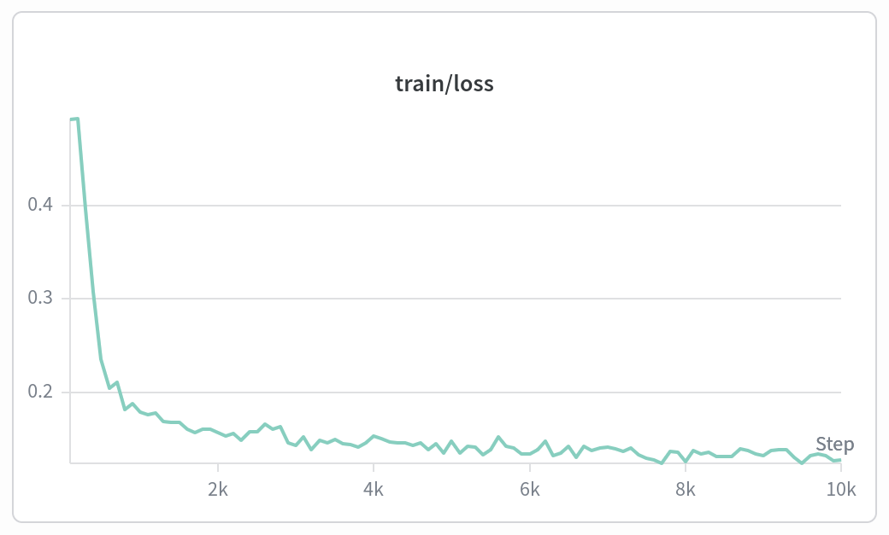
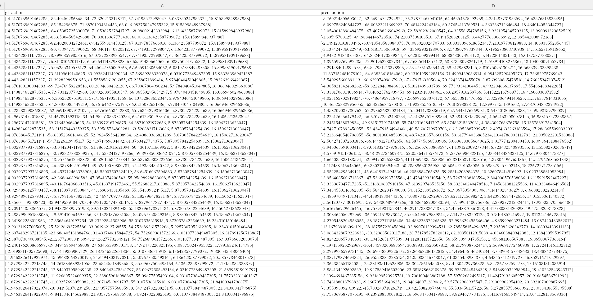

# lerobot指令记录：校准、遥操、数据录制、训练、离线评估

最近在入门VLA，花了2周走通了lerobot从校准到模型评估的全流程。

本文以so101构型为例，总结lerobot指令使用方法和注意事项。

## lerobot安装

lerobot更新较为频繁。注意自己安装的版本是v4、v5还是v6。根据版本选择教程。

安装教程：https://huggingface.co/docs/lerobot/installation

左上角可以选择版本。



由于公司采买的构型限制（[xlerobot](https://xlerobot.readthedocs.io/zh-cn/latest/software/getting_started/install.html)），在校准、遥操、数据录制、异步推理客户端环节使用稳定版本v4，训练、离线数据集评估和异步推理服务端使用版本v6。

其中，xlerobot = 2 x so101 follower + 2 x so101 leader +  Lekiwi。本文只用其中的一对儿 so101 follower + so101 leader 举例。

## 机械臂接口映射

机械臂通过usb接入PC后，通过lerobot-find-port命令，可以得到电机设备号，如/dev/ttyACM0。当有多对儿主从时，插拔顺序会使设备号频繁变化。

此时可以建立序列号到设备名的映射：

99-serial-devices.rules（idVendor/idProduct/serial换成你的）
```
SUBSYSTEM=="tty", ATTRS{idVendor}=="1a86", ATTRS{idProduct}=="55d3", ATTRS{serial}=="5B61034511", MODE="0777", SYMLINK+="so101_follower_left"
SUBSYSTEM=="tty", ATTRS{idVendor}=="1a86", ATTRS{idProduct}=="55d3", ATTRS{serial}=="5B3E089801", MODE="0777", SYMLINK+="so101_leader_left"
SUBSYSTEM=="tty", ATTRS{idVendor}=="1a86", ATTRS{idProduct}=="55d3", ATTRS{serial}=="5B61036914", MODE="0777", SYMLINK+="so101_follower_right"
SUBSYSTEM=="tty", ATTRS{idVendor}=="1a86", ATTRS{idProduct}=="55d3", ATTRS{serial}=="5B14030578", MODE="0777", SYMLINK+="so101_leader_right"
```

使用脚本[install_rules.sh](src/2026-07/install_rules.sh)使其生效。

再次使用lerobot-find-port命令，能够看到映射后的设备名。


## 校准

校准环节会得到电机的offset和最大最小限位数据，保证关节动作安全。

校准操作教程：https://huggingface.co/docs/lerobot/so101

核心就是把所有关节摆到中位，然后各个方向活动活动它，得到最大最小值。按照我这个写法，校准文件最后落盘在/home/yy/.cache/huggingface/lerobot/calibration/robots/so101_follower/R12260632.json中。

这里robot.cameras先指定为空。我记得不指定可能有报错。

```
lerobot-calibrate \
    --robot.type=so101_follower \
    --robot.id=R12260632 \
    --robot.port=/dev/so101_follower_left \
    --robot.cameras="{}"
```

标定文件样式参考[R12260632.json](src/2026-07/R12260632.json)。homing_offset就是电机安装的0位，在实际运行时候会补偿这个offset。

主臂标定和从臂一样。

## 相机

我改了这个代码，否则好像有报错：lerobot/src/lerobot/cameras/opencv/camera_opencv.py

```
# 大概 167 行
# self.videocapture = cv2.VideoCapture(self.index_or_path)
self.videocapture = cv2.VideoCapture(self.index_or_path, cv2.CAP_V4L2) # 强制使用 V4L2 后端，避免 OpenCV 自动选择不稳定的后端
```

Linux可以使用脚本[camera_check.py](src/2026-07/camera_check.py)检查相机对应的设备名，用于后续。
```
python /media/yy/Data/2026/11-VLA/scripts/camera_check.py  \
  --host 127.0.0.1 \
  --port 8090 \
  --width 1920 \
  --height 1080 \
  --fps 30 
```




## 遥操

按照此前配置的关节名、校准文件、相机名，来配置遥操指令。

遥操开始之前，注意将从臂姿态与主臂保持差不多一致，否则执行开始从臂会迅速移动。

display_data=true可实时看关节和图像数据。测试发现，如果两路相机插在同一个usb hub上可能会报错。最好分流到不同hub。

```
lerobot-teleoperate \
  --robot.type=so101_follower \
  --robot.id=R12260632 \
  --robot.port=/dev/so101_follower_left \
  --robot.calibration_dir "/home/yy/.cache/huggingface/lerobot/calibration/robots/so101_follower" \
  --robot.cameras="{ base_0_rgb: {type: opencv, index_or_path: /dev/video4, width: 640, height: 480, fps: 30, fourcc: "MJPG"}, left_wrist_0_rgb: {type: opencv, index_or_path: /dev/video7, width: 640, height: 480, fps: 30, fourcc: "MJPG"}}" \
  --display_data=true \
  --teleop.type=so101_leader \
  --teleop.id=R07260632 \
  --teleop.port=/dev/so101_leader_left \
  --teleop.calibration_dir "/home/yy/.cache/huggingface/lerobot/calibration/robots/so101_leader"
```


## 数据录制

按此配置，采集的数据默认落盘/home/yy/.cache/huggingface/lerobot/xlerobot/pick_place中。

首次录制的时候，不要加resume=true。如果要增量录制再添加此参数。resume=true时dataset.num_episodes为增量数量。

dataset.num_episodes是录制每个episode的最长时长，右键提前终止本条录制，左键重新录制。

dataset.reset_time_s是重置环境的时长。

打开声音。录制过程中它会语音提示。

```
lerobot-record \
  --robot.disable_torque_on_disconnect=true \
  --robot.type=so101_follower \
  --robot.id=R12260632 \
  --robot.port=/dev/so101_follower_left \
  --robot.calibration_dir "/home/yy/.cache/huggingface/lerobot/calibration/robots/so101_follower" \
  --robot.cameras="{ base_0_rgb: {type: opencv, index_or_path: /dev/video4, width: 640, height: 480, fps: 30, fourcc: "MJPG"}, left_wrist_0_rgb: {type: opencv, index_or_path: /dev/video6, width: 640, height: 480, fps: 30, fourcc: "MJPG"}}" \
  --teleop.type=so101_leader \
  --teleop.id=R07260632 \
  --teleop.port=/dev/so101_leader_left \
  --teleop.calibration_dir "/home/yy/.cache/huggingface/lerobot/calibration/robots/so101_leader" \
  --display_data=false \
  --dataset.repo_id=xlerobot/pick_place \
  --dataset.num_episodes=15 \
  --dataset.episode_time_s=120 \
  --dataset.reset_time_s=5 \
  --dataset.single_task="Pick up the block and place it on the plate." \
  --dataset.push_to_hub=false \
  --resume=true
```

数据文件结构：data保存关节的观测和动作数据（action是主臂，observation是从臂，可以在vscode里面安装parquet explorer插件查看数据），meta保存一些元数据（total_frames、关节统计值等），videos保存感知数据。




查看数据可以使用指令：
```
lerobot-dataset-viz \
  --root /home/yy/.cache/huggingface/lerobot/xlerobot/pick_place \
  --repo-id local/pick_place \
  --episode-index 0
```




也可以使用在线工具：https://io-ai.tech/lerobot/





## 模型训练

### docker

```
docker pull huggingface/lerobot-gpu
```

启动docker
```
#docker启动时指定--network host，程序端口号会从容器穿透到宿主机
sudo docker run -it \
  -u root \
  -v /home/docker-develop/youyue/lerobot/models:/lerobot/models \
  -v /home/docker-develop/youyue/lerobot/datasets:/lerobot/datasets/ \
  -v /home/docker-develop/youyue/lerobot/outputs:/lerobot/outputs/ \
  -v /home/docker-develop/youyue/lerobot/script:/lerobot/script/ \
  -v /home/docker-develop/youyue/lerobot/torch/hub/checkpoints:/home/user_lerobot/.cache/torch/hub/checkpoints \
  --shm-size 32gb \
  --network host \
  --gpus all \
  --name lerobot \
  huggingface/lerobot-gpu:latest

```

如果需要多卡训练，进入docker后：

```
unset CUDA_VISIBLE_DEVICES
export CUDA_VISIBLE_DEVICES=0,1 # 按你的来
```

### act

参考教程：https://huggingface.co/docs/lerobot/v0.6.0/en/act

文档说默认参数就能实现较好效果。默认steps是10w步。

数据集采用离线方式，指定目录dataset.root即可，repo_id可以任意填。

```
lerobot-train \
    --dataset.root=./datasets/pick_place \
    --dataset.repo_id=local/pick_place \
    --output_dir=./outputs/act \
    --job_name=act \
    --policy.type=act \
    --policy.push_to_hub=false \
    --policy.device=cuda \
    --wandb.enable=true \
    --wandb.mode=offline
```

大概需要5G显存。参数量：

```
INFO 2026-07-22 02:10:52 ot_train.py:412 Effective batch size: 8 x 1 = 8
INFO 2026-07-22 02:10:52 ot_train.py:413 num_learnable_params=51619729 (52M)
INFO 2026-07-22 02:10:52 ot_train.py:414 num_total_params=51619729 (52M)
```

### pi05

教程见：https://huggingface.co/docs/lerobot/v0.6.0/en/pi05

pi05可按训练资源选择训练方式。

对于steps的设置，先根据数据集大小决定epoch数量。小数据集控制在5 epochs 以内防止过拟合。我采集了60条数据，total_frames = 30000，batch_size = 8，准备训练2.5 epoch。那么：steps = epoch * total_frames / batch_size = 10000。此配置参考[LIBERO微调](https://github.com/xuweiwu/openpi/blob/main/src/openpi/policies/libero_policy.py)。


#### pi05_lora

base模型配置的本地目录models/pi05_base。提前下载好的。

此时所有参数开放训练（policy.freeze_vision_encoder=false，policy.train_expert_only=false），同时指定AB阵的秩peft，peft.r=16，数值越大越容易过拟合。

```
lerobot-train \
    --dataset.root=./datasets/pick_place \
    --dataset.repo_id=local/pick_place \
    --output_dir=./outputs/pi05_lora \
    --job_name=pi05_lora \
    --policy.type=pi05 \
    --policy.pretrained_path=models/pi05_base \
    --policy.compile_model=true \
    --policy.gradient_checkpointing=true \
    --policy.push_to_hub=false \
    --policy.dtype=bfloat16 \
    --policy.optimizer_lr=5e-5 \
    --policy.freeze_vision_encoder=false \
    --policy.train_expert_only=false \
    --policy.device=cuda \
    --optimizer.type=adamw \
    --peft.method_type=LORA \
    --peft.r=16 \
    --peft.lora_alpha=16 \
    --steps=10000 \
    --save_freq=2000 \
    --log_freq=100 \
    --batch_size=8 \
    --wandb.enable=true \
    --wandb.mode=offline
```

1张4090就能cover，大概需要12G显存。参数量：

```
INFO 2026-07-22 07:45:10 ot_train.py:412 Effective batch size: 8 x 1 = 8
INFO 2026-07-22 07:45:10 ot_train.py:413 num_learnable_params=1287168 (1M)
INFO 2026-07-22 07:45:10 ot_train.py:414 num_total_params=4144691984 (4B)
```

#### pi05_full

可以根据需求配置policy.freeze_vision_encoder和policy.train_expert_only。

4090只能跑起来policy.train_expert_only=true。其他则需要A100。

注意下面的batch_size其实需要根据卡数来调整。

```
accelerate launch \
  --multi_gpu \
  --num_processes=2 \
  $(which lerobot-train) \
    --dataset.root=./datasets/pick_place \
    --dataset.repo_id=local/pick_place \
    --output_dir=./outputs/pi05_full \
    --job_name=pi05_full \
    --policy.type=pi05 \
    --policy.pretrained_path=models/pi05_base \
    --policy.compile_model=true \
    --policy.gradient_checkpointing=true \
    --policy.push_to_hub=false \
    --policy.dtype=bfloat16 \
    --policy.freeze_vision_encoder=false \
    --policy.train_expert_only=false \
    --policy.device=cuda \
    --steps=10000 \
    --save_freq=2000 \
    --log_freq=100 \
    --batch_size=8 \
    --wandb.enable=true \
    --wandb.mode=offline

```


### 训练过程分析

注册wandb账号（[wandb.ai](https://wandb.ai/site)），创建一个api token复制。

```
wandb login
# 输入api token登陆
```

同步wandb训练记录到online：
```
cd outputs/pi05_lora/wandb
wandb sync ./latest-run
```

可以看到训练过程信息，确保loss走势正常：





## 离线评估

lerobot官方不提供离线数据集评估功能。

可以使用[脚本eval_offline_dataset_policy.py](src/2026-07/eval_offline_dataset_policy.py)。通过指定策略、数据集、episode_index，以及eval模式（single action / action chunk），使用策略对离线数据集的每一帧observation推理action，并保存csv文件，对比observation、gt_action和pred_action，确保真机上不出现意外。policy.use_peft=true能自动加载lora微调模型：

```
python script/eval_offline_dataset_policy.py \
  --dataset.root=./datasets/pick_place \
  --dataset.repo_id=local/pick_place \
  --policy.type=pi05 \
  --policy.pretrained_path=./outputs/pi05_lora/checkpoints/last/pretrained_model \
  --policy.use_peft=true \
  --eval.episode=0 \
  --eval.inference_mode=action_chunk \
  --eval.sequence_len=50
```

真值与预测数据对比：

```
# 程序最后输出每个关节gt值与pred值的MAE 
INFO 2026-07-23 08:26:47 t_policy.py:614 Per-dimension MAE: {'shoulder_pan.pos': 6.740723, 'shoulder_lift.pos': 17.316374, 'elbow_flex.pos': 20.287167, 'wrist_flex.pos': 8.223774, 'wrist_roll.pos': 3.614673, 'gripper.pos': 8.349299}
```




当然，另外的选择是用仿真引擎，还没研究。


## 异步推理

教程见：https://huggingface.co/docs/lerobot/v0.6.0/en/async

教程中同时包含同步推理和异步推理的区别。简而言之，异步推理可以在动作执行的间隙进行推理，缩小执行时延。

假设有一台GPU机器（服务端）负责远程推理，一台PC（客户端）负责连接robot进行控制，那么可以使用异步的方式测试policy。客户端配置policy，将参数打包成一个请求发给服务器端，服务器加载策略模型，打包推理结果给PC，PC发送给robot电机执行。

在GPU端，启动策略服务器：

```
python -m lerobot.async_inference.policy_server \
  --host=192.168.31.146 \
  --port=5858
```

在PC端，请求推理：

```
# 注意，目前不支持peft模型进行异步推理，可以自己让codex改改代码实现
python -m lerobot.async_inference.robot_client \
  --server_address="192.168.31.146:5858" \
  --robot.disable_torque_on_disconnect=true \
  --robot.type=so101_follower \
  --robot.id=R12260632 \
  --robot.port=/dev/so101_follower_left \
  --robot.calibration_dir "/home/yy/.cache/huggingface/lerobot/calibration/robots/so101_follower" \
  --robot.cameras="{ base_0_rgb: {type: opencv, index_or_path: /dev/video4, width: 640, height: 480, fps: 30, fourcc: "MJPG"}, left_wrist_0_rgb: {type: opencv, index_or_path: /dev/video7, width: 640, height: 480, fps: 30, fourcc: "MJPG"}}" \
  --task="Pick up the block and place it on the plate." \
  --policy_type=pi05 \
  --policy_device=cuda \
  --pretrained_name_or_path=outputs/pi05_lora/checkpoints/last/pretrained_model \
  --actions_per_chunk=50 \
  --chunk_size_threshold=0.5 \
  --aggregate_fn_name=weighted_average \
  --debug_visualize_queue_size=True
```
    