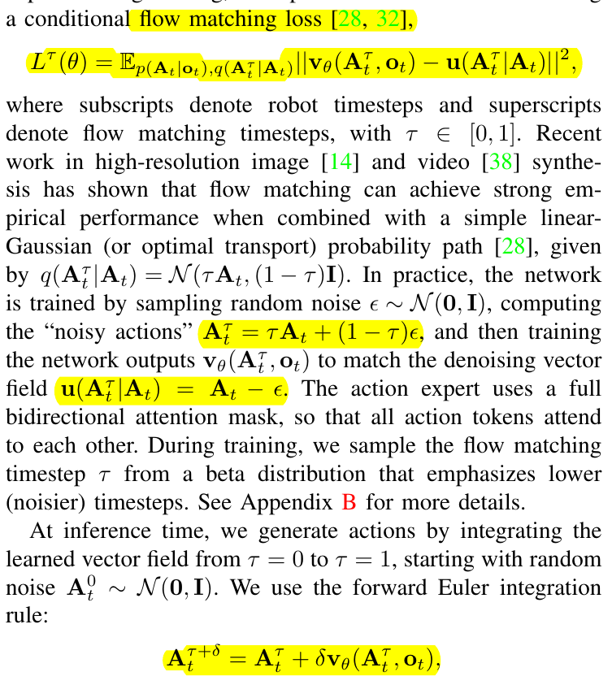
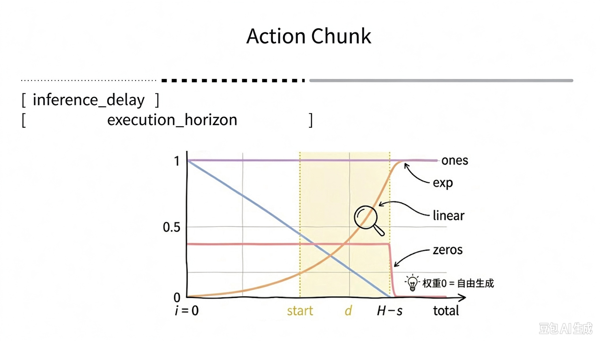
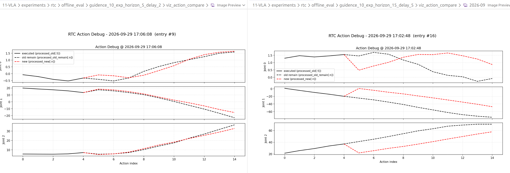
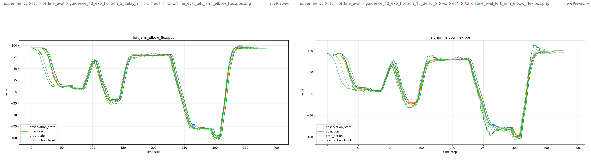

# jax版Pi05+RTC优化记录

## Flow Matching Loss简析



- 公式1&3：flow matching loss是 『去噪速度 = 干净动作 - 噪声』 的 mse
- 公式2：从beta分布采样参数$\tau$生成噪声动作，带入0/1，$A_t^0=\epsilon$是纯噪声，$A_t^1=A_t$是干净动作。
- 公式3：去噪过程是从纯噪声$A_t^0$通过10次欧拉积分（曲线=多个直线线段）得到干净动作$A_t^1$

$$A_t^{0.1}=A_t^0+\delta(A_t-\epsilon)\\
A_t^{0.2}=A_t^{0.1}+\delta(A_t-\epsilon)=A_t^0+2\delta(A_t-\epsilon)\\
A_t^{0.3}=A_t^{0.2}+\delta(A_t-\epsilon)=A_t^0+3\delta(A_t-\epsilon)\\
...\\
A_t^1=A_t^0+10\delta(A_t-\epsilon)=A_t^0+A_t-\epsilon\\
=>A_t^1 = A_t, A_t^0 = \epsilon
$$


## RTC原理简析



```python
def step(carry):
    x_t, time = carry
    if use_rtc:
        v_t = _rtc.rtc_denoise_step_jax( #（4）RTC去噪函数
            denoise_fn=lambda actions: denoise_step(actions, time),
            x_t=x_t,
            prev_chunk_left_over=prev_chunk_left_over, #（5）旧Chunk
            inference_delay=inference_delay, # (6) 延时已执行的动作
            time=time,
            execution_horizon=execution_horizon, # (7) 引导长度
            config=self.rtc_config,
        )

    else:
        # (2) 正常去噪函数
        v_t = denoise_step(x_t, time)
    # (3) dt是负数，去噪方向是噪声->动作，所以速度的逆向是噪声->动作，速度的方向是动作->噪声
    return x_t + dt * v_t, time + dt 

def cond(carry):
    x_t, time = carry
    # robust to floating-point error
    return time >= -dt / 2

# (1) 循环控制 time 1.0->0.0（和论文0->1的方向相反），time 可以理解为去噪还剩的时间
x_0, _ = jax.lax.while_loop(cond, step, (noise, 1.0))
```

```python
def denoise_and_x1(actions: jax.Array) -> tuple[jax.Array, jax.Array]:
    v_t = denoise_fn(actions)
    #（8）actions是带噪动作，time是噪声->动作还剩的时间，-vt是噪声->动作的速度，所以x1_t是干净动作的一步预测（不欧拉积分）
    x1_t = actions - time * v_t 
    return x1_t, v_t
    
(x1_t, v_t), vjp_fn = jax.vjp(denoise_and_x1, x_t_3d)

#（9）得到x1_t朝向prev_chunk变化的梯度
err = (prev_chunk - x1_t) * weights 
correction = vjp_fn((err, jnp.zeros_like(v_t)))[0]

#（10）引导权重，由max_guidence_weight控制（类似于学习率）
# 头和尾强引导
#   ↑
#∞  │╲                          ╱
#   │ ╲                        ╱
#   │  ╲                      ╱
#   │   ╲                    ╱
# 2 │    ╲______       _____╱
#   │           ╲_____╱
#   └────────────────────────→ τ
#    0          0.5          1
guidance = _guidance_weight(time, config.max_guidance_weight).astype(v_t.dtype)

#（11）将梯度应用到v_t上，因为去噪模型的输出是速度
# err = (prev_chunk - x1_t) * weights
#     = (prev_chunk - (actions - time * v_t) ) * weights
#     = (prev_chunk - actions  + time * v_t) * weights
# err与vt同号，所以要让err降低，vt沿着反向梯度行进
result = v_t - guidance * correction
```

## RTC调试经验

- 首帧不进行guidence效果会变好
- 参数敏感性：延时高（500ms以上）、帧率低（10fps），默认参数下机械臂回抖剧烈（排查结论是chunk接缝跳变，旧轨迹horizon drift不适合引导新轨迹），将max_guidence_weight调小可以抑制
- delay越小，轨迹越贴合，越与guidence参数无关

    离线对比日志

    guidence_10_exp_horizon_5_delay_2
    ====== (err_before - err_after) 数值统计 ======
    样本：396
    mean：0.00020327
    median：0.00006795

    guidence_10_exp_horizon_15_delay_5
    ====== (err_before - err_after) 数值统计 ======
    样本：621
    mean：0.00105032
    median：0.00033160

    guidence_0.5_exp_horizon_5_delay_2
    ====== (err_before - err_after) 数值统计 ======
    样本：396
    mean：0.00002601
    median：0.00001253

    guidence_0.5_exp_horizon_15_delay_5
    ====== (err_before - err_after) 数值统计 ======
    样本：621
    mean：0.00015067
    median：0.00005646

    

    


## 效果视频

[1-sync](image/2026-09/1-sync.mp4) 同步推理，有明显卡顿

[2-async](image/2026-09/2-async.mp4) 异步推理，直接替换chunk，剧烈抖动

[3-async_rtc](image/2026-09/3-async_rtc.mp4) 异步推理+inference rtc，回抖

[4-async_rtc_model](image/2026-09/4-async_rtc_model.mp4) 异步推理+inference rtc+rtc model，没有卡顿，轻微回抖，成功率也上升

